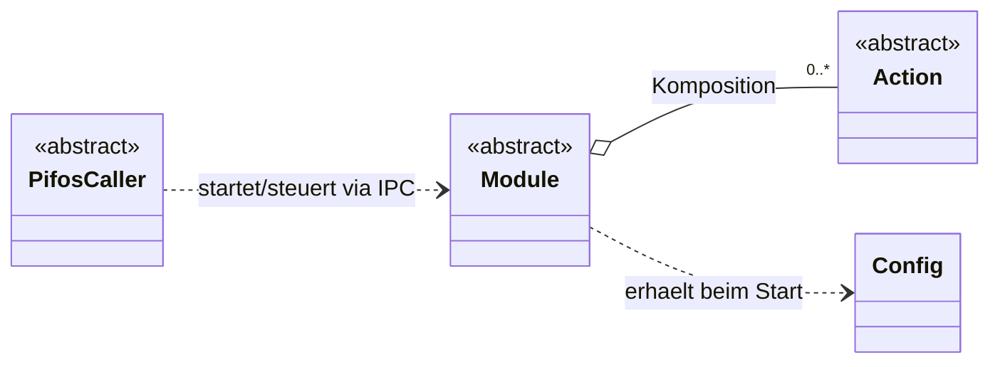
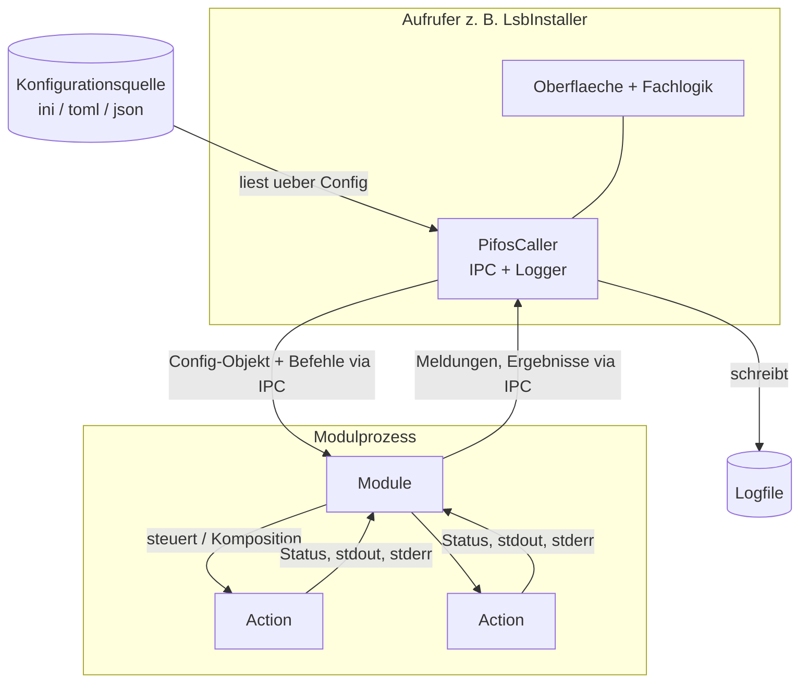
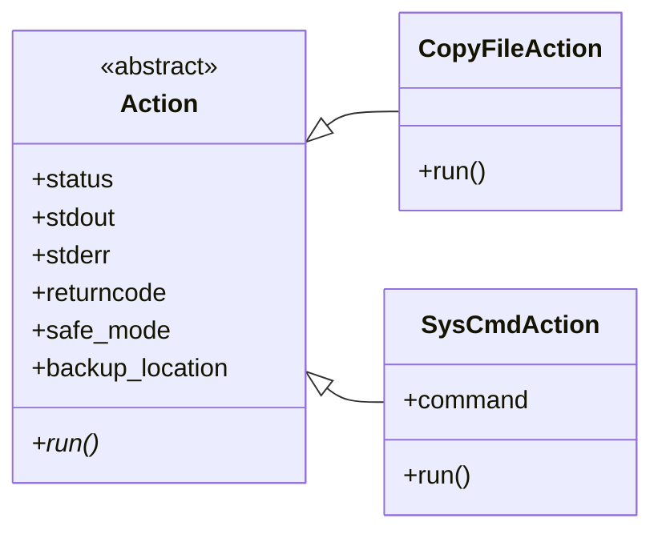
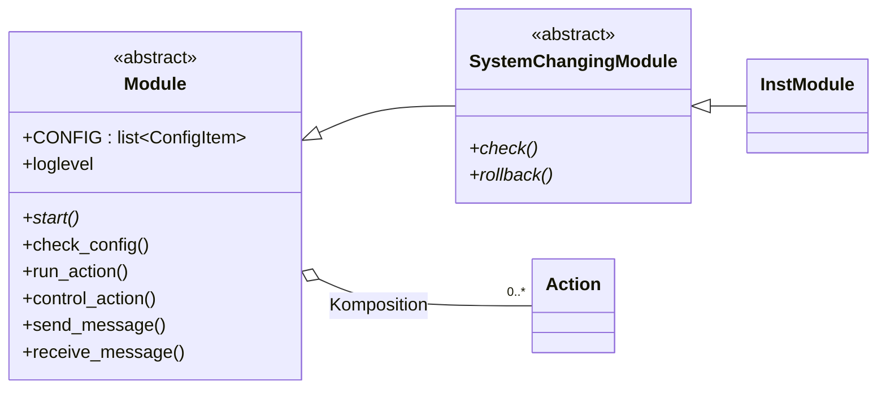
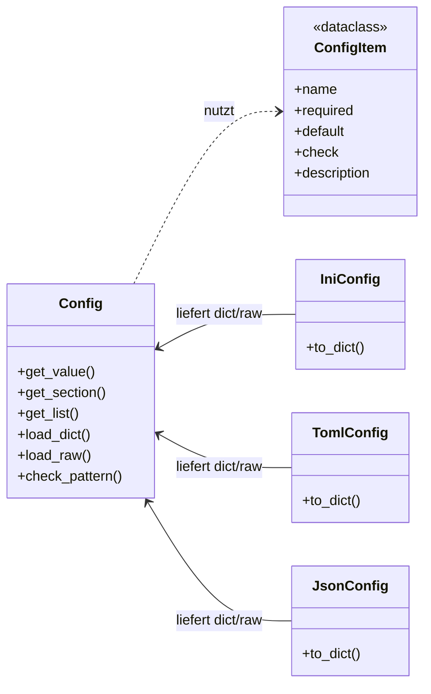
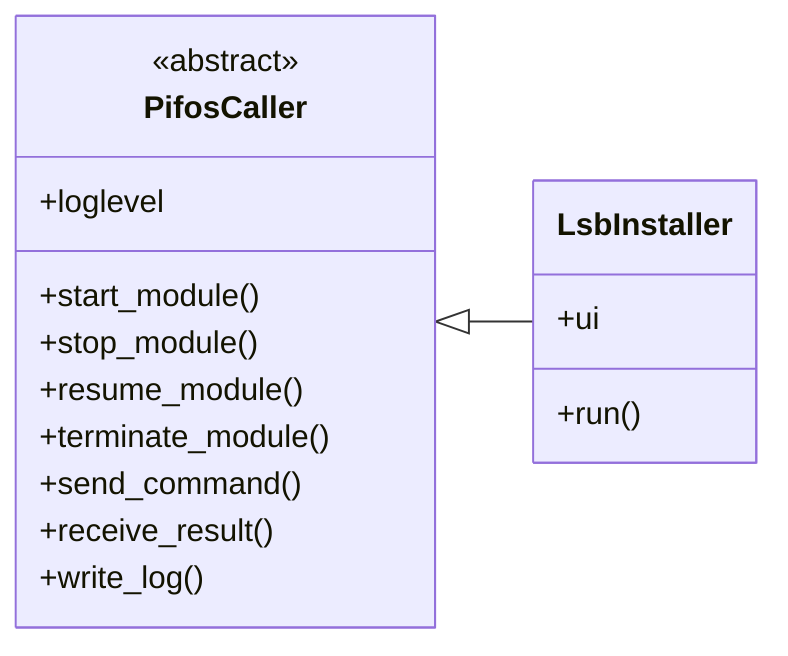
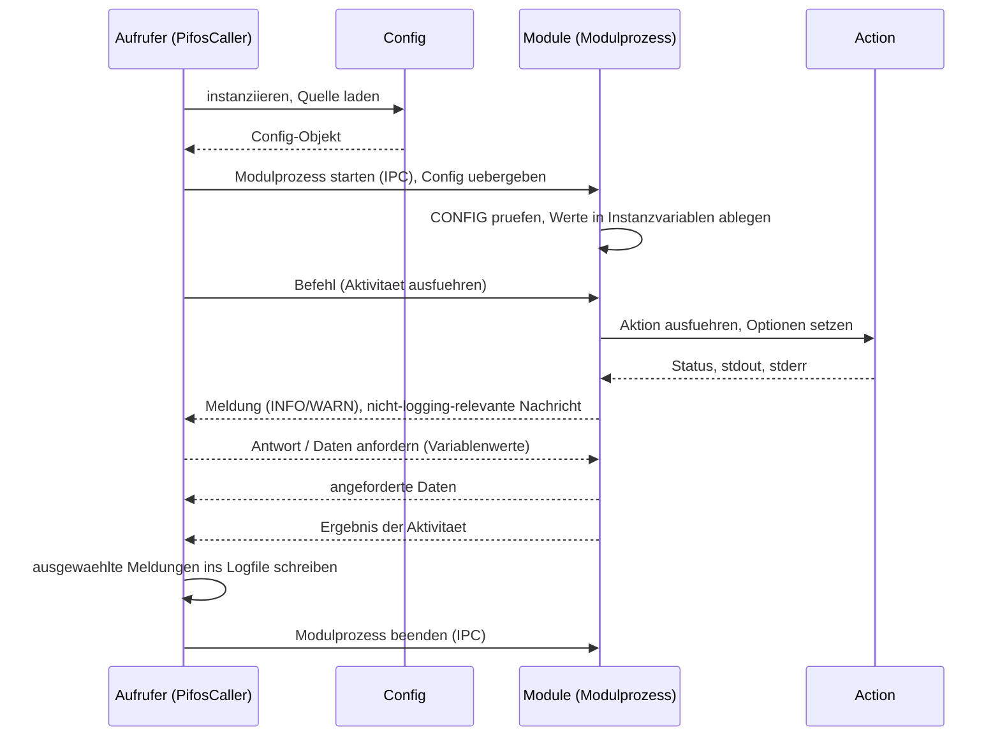
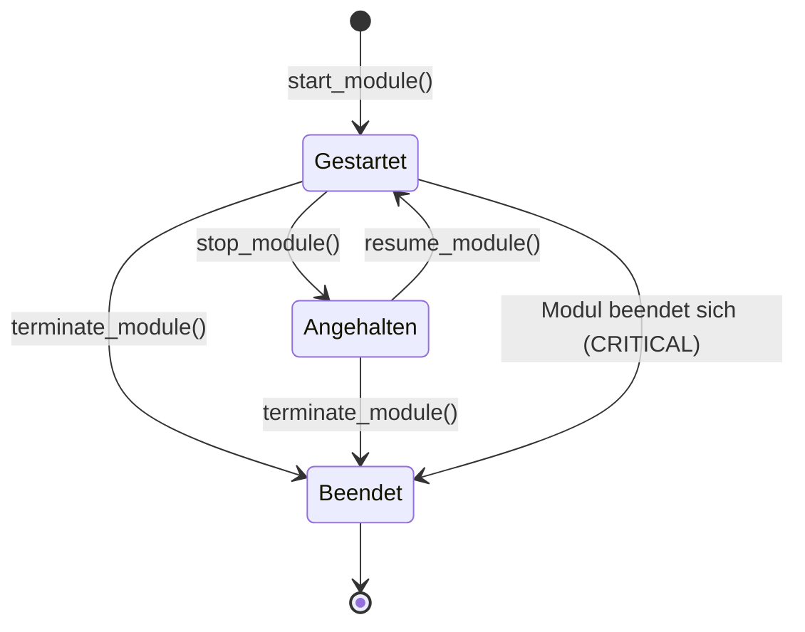

# pifos — Implementierungsplan

**Status:** [in Bearbeitung] · **Stand:** 2026-06-27

Dieser Plan beschreibt die Umsetzung von *pifos* auf Grundlage der Dokumente `docs/01_konzept.md`, `docs/02_anforderungen.md` und `docs/03_machbarkeit.md`.

Die Kennungen in Klammern (etwa ÜBR-01, SIC-03) verweisen auf die Anforderungen in `docs/02_anforderungen.md`.

Die Sicherheitsanforderungen aus Kapitel 13 „Sicherheit" der Anforderungen `docs/02_anforderungen.md` 

## Inhaltsverzeichnis

**1. Überblick und Architektur**  
**2. Aktionen**  
**3. Module**  
**4. Konfiguration**  
**5. Aufrufer-Basisklasse PifosCaller**  
**6. Prozessmodell, Steuerung und IPC**  
**7. Logging**  
**8. Fehlerbehandlung und Ausnahmen**  

## 1. Überblick und Architektur

*pifos* besteht aus den drei grundlegenden Komponenten *Aktionen*, *Module* und *Konfiguration*, sowie einer Aufrufer-Basisklasse zur leichteren Nutzung von *pifos* und einiger Helfer-Klassen (ÜBR-01). 

Jede der grundlegenden Komponenten wird durch eine Python-Klasse repräsentiert. *pifos* wir als Python-Paket `pifos/` mit kurzen Modulnamen zur verfügung gestellt. *Aktionen* und *Konfigurationen* werden in den Unterpaketen `actions/` und `config/` abgelegt.

| Modul in `pifos/` | Inhalt |
|---|---|
| `action.py` | abstrakte Basisklasse `Action` |
| `actions/` (Unterpaket) | generische Aktionen, u. a. `SysCmdAction`, `CopyFileAction` |
| `module.py` | abstrakte Basisklassen `Module`, `SystemChangingModule` |
| `config/` (Unterpaket) | `Config`, `ConfigItem`, Formatklassen `IniConfig`, `JsonConfig`, `TomlConfig` |
| `caller.py` | abstrakte Basisklasse `PifosCaller` |
| `ipc.py` | `IpcMessage`, Enums `MessageKind`, `LogLevel` |
| `runner.py` | Einsprungfunktion des Modulprozesses |
| `errors.py` | Ausnahmehierarchie `PifosError` und Ableitungen |


### 1.1 Zusammenwirken

Aufrufende Skripte sollten eine Klasse beinhalten, welche von `PifosCaller` in `caller.py` erbt. Die Klasse `PifosCaller` stellt alle wesentlichen Funktionen zur Nutzung von *pifos* einschl. der IPC-Funktionalität zur Verfügung.  

Der Aufrufer instanziiert ein Config-Objekt mit einem spezfischen Konfigformat (z. B. 'ini', 'toml', 'json' usw.) und startet ein oder mehrere Module jeweils als eigenen Prozess (STR-01, STR-02). Dabei werden die erforderlichen Config-Daten als Config-Objet an das Modul übergeben. Ein Modul wiederum hat eine oder mehrere Aktionen (Komposition) und steuert diese über Parameter und Instanzvariablen (MOD-1, MOD-06).  Das Modul leitet Meldungen, Ergebnisse und Ausnahmen über IPC an den Aufrufer. Die Führung des Logfiles ist Sache des Aufrufers (LOG-01, LOG-02).

Ein Beispiel für eine konkrete Action-Klasse und Formatklasse, sowie weitere Hilfsklassen und vollständige Methodenlisten für die abstrakten Klassen werden in den nachfolgenden Kapiteln (*2. Aktionen*, *3. Module* und *4. Konfiguration*) beschrieben.



Das folgende Datenflussdiagramm zeigt den bereits oben beschriebenen Datenfluss zur Laufzeit. Der Aufrufer liest die Konfiguration über `Config` aus der Quelle, startet dModulprozesse und führt die Logdatei. Aktionen erfassen Status und Ausgaben der ausgeführten Befehele. Das Modul liest den Satus aus den Instanzvariablen der Aktionen und erstellt daraus Meldungen ie per IPC an den Aufrufer weitergelietet werden. Der Aufrufer verarbeitet die Meldungen, trifft anhand diese Meldungen ggf. Entscheidungen und schreibt eine Logdatei (LOG-01, LOG-02).



### 1.2 Empfehlung zur Code-Gestaltung

Grundsätzlich sollte der einfachste Weg gewählt werden um eine Aufgabe zu lösen (KISS: 'keep it simple and stupid). Unnötige Verberbungen und komplexe Vererbunhsstrukturen sollten vermieden werden. Komponenten (z. B. Config-Format-Klassen, oder Aktions-Klassen) sollten nur dann entwicklet werden wenn dich auch wirkliche benötigt werden (ÜBR-03, ÜBR-05).

Öffentliche Attribute sind i. d. R direkt über `x.obj` zugänglich, *getter* und *setter* (`get_x()`/`set_x()`) werden nicht genutzt. Ein Zugriff über `@property` kann beo Bedarf genutzt werden (ÜBR-04).


## 2. Aktionen

Eine *Aktion* erledigt genau eine Aufgabe und stellt deren Ausführung und Ausgaben vollständig dem aufrufenden Modul zur Verfügung (AKT-01, AKT-02). Alle Aktionen leiten von der abstrakten Basisklasse `Action` ab, die gemeinsame Variablen und Methoden festlegt (AKT-05). Dieses Kapitel beschreibt die Basisklasse

Das folgende Klassendiagramm zeigt die Basisklasse `Action` mit ihren Attributen und die beiden konkreten Aktionen, die von ihr erben.



### 2.1 Basisklasse Action

`Action` ist eine abstrakte Basisklasse (`abc.ABC`) in `action.py`. Sie hält den Ausführungszustand in Instanzvariablen und schreibt jeder konkreten Aktion eine `run`-Methode vor.

| Variable | Typ | Bedeutung |
|----------|-----|-----------|
| `status` | `str` | Zustand der Ausführung (z. B. neu, läuft, fertig, fehlgeschlagen) |
| `stdout` | `str` | Standardausgabe der Ausführung |
| `stderr` | `str` | Fehlerausgabe der Ausführung |
| `returncode` | `int \| None` | Rückgabewert, sofern die Aktion einen Befehl ausführt |
| `safe_mode` | `bool` | bei dateiändernden Aktionen: Sicherung vor der Änderung |
| `backup_location` | `str \| None` | Zielverzeichnis der Sicherung (AKT-07) |

Die abstrakte Methode `run(self) -> int` führt die Aufgabe aus; jede konkrete Aktion implementiert sie. Sie füllt `status`, `stdout`, `stderr` und `returncode` und gibt einen Rückgabewert zurück. Das Modul liest diese Werte direkt als öffentliche Attribute, etwa `action.status` oder `action.stdout` (AKT-02); benannte Lesemethoden entfallen nach der Festlegung in Abschnitt 1.3 (Attributzugriff). Braucht ein Attribut beim Lesen oder Setzen Logik, kapselt eine `@property` sie, ohne die Zugriffsschreibweise `action.x` zu ändern.

Tritt während `run` ein Fehler auf, erzeugt die Aktion eine Ausnahme der Klasse `ActionError` (siehe Kapitel 8 „Fehlerbehandlung und Ausnahmen"), die das aufrufende Modul erhält (AKT-03, EXC-01). `safe_mode` und `backup_location` liegen in der Basisklasse; genutzt werden sie allein von dateiändernden Aktionen (Abschnitt 2.3). Aktionen ohne Dateiänderung lassen `safe_mode` unberührt.

Optionen passen eine Aktion an Bedingungen ihrer Ausführung an, ohne ihren atomaren Charakter zu verändern (AKT-04). Sie werden als Konstruktorargumente übergeben oder als Attribut gesetzt, nicht durch zusätzliche Aufgaben in `run`.

### 2.2 Systembefehl-Aktion SysCmdAction

`SysCmdAction(Action)` in `actions/` ist die generische Aktion für Systembefehle ohne eigene spezifische Aktion (AKT-08). Sie ist die am stärksten exponierte Stelle und setzt die Sicherheitsanforderungen der Befehlsausführung um.

Der Konstruktor nimmt den Befehl als Liste einzelner Elemente und eine Zeitgrenze:

```
SysCmdAction(command: list[str], timeout: float,
             cwd: str | None = None, env: dict[str, str] | None = None)
```

`run` führt den Befehl mit `subprocess.Popen` aus. Die Festlegungen:

Die Ausführung erfolgt ohne Shell (`shell=False`) (SIC-03). Befehl und Argumente werden als Liste übergeben, nicht als zusammengesetzte Befehlszeichenkette (SIC-04). `command` ist daher eine `list[str]`; eine Zeichenkette wird nicht angenommen. Jede Ausführung trägt die explizite Zeitgrenze `timeout`; nach Ablauf wird der Prozess beendet und der Fehler als Ausnahme gemeldet (SIC-05). Bei sicherheitsrelevanten Programmen wird der Programmpfad als absoluter Pfad angegeben oder in einer kontrollierten Umgebung (`env` mit gesetztem `PATH`) aufgelöst (SIC-06).

`Popen` mit getrennten Strömen für stdout und stderr erlaubt das laufende Auslesen während langer Befehle; die Aktion erfasst beide Ströme und den Returncode und stellt sie dem Modul bereit (AKT-02). Bei Bedarf reicht das Modul Ausgaben laufend als Meldungen an den Aufrufer (LOG-02). `subprocess.run` ist nicht gewählt, weil es das Ergebnis erst am Ende liefert und keine laufende Statusmeldung erlaubt.

Werte aus der Konfiguration, die als Argument in `command` oder als Programmpfad einfließen, prüft das aufrufende Modul vor der Übergabe auf Typ, Format und Wertebereich anhand einer Positivliste; die Aktion selbst nimmt keine inhaltliche Prüfung vor (SIC-01, SIC-02). Die Prüfung liegt beim Modul, weil der Konfigurationsbaustein bewusst nicht inhaltlich prüft (Kapitel 3 „Module" und Kapitel 4 „Konfiguration").

### 2.3 Dateiändernde Aktionen und safe-mode

Aktionen, die Dateien ändern, überschreiben oder löschen, bieten den aktivierbaren safe-mode, der die Datei vor der Änderung sichert (AKT-06). `CopyFileAction` ist ein erstes Beispiel; weitere entstehen bei Bedarf.

Ist `safe_mode` gesetzt, legt die Aktion vor der Änderung eine Kopie der Datei an. Standardziel ist derselbe Pfad mit einem Zeitstempel-Zusatz im Namen; das Ziel ist über `backup_location` auf ein anderes Verzeichnis umstellbar (AKT-07). Die Sicherung trägt sich in die Undo-Registratur des aufrufenden systemverändernden Moduls ein und dient damit zugleich dem Rollback (Kapitel 3 „Module").

Die Sicherung ist sicherheitsrelevant und unterliegt drei Vorkehrungen. Die Zugriffsrechte der Sicherung gehen nicht über die der Originaldatei hinaus; die Kopie übernimmt deren Rechte und weitet sie nicht aus (SIC-13). `backup_location` wird vor der Nutzung als Pfad geprüft und auf das vorgesehene Verzeichnis begrenzt (SIC-14). Prüfung und Schreiben erfolgen so, dass Manipulation über symbolische Verweise und zeitliche Wettläufe zwischen Prüfung und Nutzung vermieden werden, etwa durch Öffnen ohne Folgen symbolischer Verweise und Schreiben über einen Dateideskriptor statt erneut über den Pfad (SIC-15).

### 2.4 Vertagtes Detail

Der konkrete Satz weiterer Aktionen über `SysCmdAction` und `CopyFileAction` hinaus entsteht mit den ersten Modulen, die sie benötigen. Eine Aufzählung vorab wäre Spekulation ohne Bedarf (ÜBR-05). Das Umkehrverhalten je dateiändernder Aktion für die Undo-Registratur ist in Kapitel 3 „Module" behandelt.

## 3. Module

Ein *Modul* erledigt eine Aufgabe über *Aktionen*, erhält seine Parameter als `Config`-Objekt und erbt von der gemeinsamen Basisklasse `Module` (MOD-01, MOD-02, MOD-05). Systemverändernde Module erben von der Zwischenklasse `SystemChangingModule`, die den Überprüfungsmodus und den Rollback vorschreibt (MOD-12, MOD-13). Dieses Kapitel beschreibt beide Basisklassen, die deklarative Konfiguration und ihre Prüfung.

Das folgende Klassendiagramm zeigt die Basisklasse `Module`, die abstrakte Zwischenklasse `SystemChangingModule` mit einem konkreten Modul sowie die Komposition mit `Action`.



### 3.1 Basisklasse Module

`Module` ist eine abstrakte Basisklasse in `module.py`. Sie stellt das gemeinsame Grundset bereit: Zugriff auf die Systemumgebung, das Ausführen und Steuern von Aktionen sowie die Interaktion mit dem aufrufenden Prozess (MOD-05).

Das Klassenattribut `CONFIG: list[ConfigItem]` deklariert die benötigte Konfiguration (MOD-08); leer bei Modulen ohne Konfiguration (MOD-03). Die Instanzvariable `loglevel` trägt das vom Aufrufer übergebene Loglevel (LOG-05). Die geprüften Konfigurationswerte legt das Modul in eigenen Instanzvariablen ab (MOD-04).

| Methode | Zweck |
|---------|-------|
| `start(self) -> int` | abstrakt: führt die Modulaufgabe aus, gibt den Rückgabewert zurück |
| `check_config(self, config: Config) -> None` | prüft die Werte beim Start anhand `CONFIG` und legt sie ab (MOD-09) |
| `run_action(self, action: Action) -> int` | führt eine Aktion aus und übernimmt deren Status (MOD-01) |
| `control_action(self, action, **options) -> None` | steuert eine Aktion über Parameter oder Instanzvariablen (MOD-06) |
| `send_message(self, level, name, payload) -> None` | reicht eine Meldung an den Aufrufer (LOG-02) |
| `receive_message(self) -> IpcMessage` | nimmt einen Befehl des Aufrufers an (STR-04) |

`send_message` und `receive_message` kapseln den IPC-Kanal des Modulprozesses (Kapitel 6 „Prozessmodell, Steuerung und IPC"); die konkrete Aufgabe in `start` ruft sie, ohne die IPC-Technik zu kennen. Module tragen beschreibende Namen, aus denen ihr Typ erkennbar ist, etwa ein Installationsmodul als `InstModule` oder mit Präfix `inst_` (MOD-07).

### 3.2 Konfigurationsdeklaration und Prüfung

Ein Modul macht über `CONFIG` sichtbar, welche Konfiguration es benötigt (MOD-08). Jeder Eintrag ist ein `ConfigItem` (Kapitel 4 „Konfiguration") mit Name, Verbindlichkeit, Vorgabewert, Prüfung und Beschreibung. Die Deklaration unterscheidet Pflicht- von Kann-Werten über das Feld `required` (MOD-10). Wo möglich, trägt ein Eintrag einen sinnfälligen Vorgabewert (MOD-11).

Beim Start prüft `check_config` die eingehenden Werte anhand der Deklaration: Pflichtwerte müssen vorhanden sein, fehlende Kann-Werte erhalten ihren Vorgabewert, und das Feld `check` wird angewendet (MOD-09). Die Prüfung ist formal, nicht inhaltlich (KFG-08). Werte, die das Modul anschließend als Argument eines Systembefehls oder als Dateipfad verwendet, prüft es vor dieser Verwendung auf Typ, Format und Wertebereich anhand einer Positivliste, da der Konfigurationsbaustein keine inhaltliche Prüfung vornimmt (SIC-01, SIC-02). Nach erfolgreicher Prüfung legt das Modul die Werte in seinen Instanzvariablen ab (MOD-04).

### 3.3 Systemverändernde Module

Module, die das System verändern, erben von der abstrakten Zwischenklasse `SystemChangingModule(Module)` in `module.py`. Sie schreibt zwei abstrakte Methoden vor und erzwingt damit deren Vorhandensein schon bei der Klassendefinition; eine reine Namenskonvention prüfte das nicht.

`check(self) -> bool` ist der Überprüfungsmodus: Er prüft den Erfolg der eigenen Aktionen und Eingriffe gezielt und vollständig (MOD-12). `rollback(self) -> None` macht die Eingriffe rückgängig (MOD-13). Die Zwischenklasse ist die einzige zusätzliche Vererbungsebene; eine feinere Aufteilung in Untertypen entsteht erst bei konkretem Bedarf (ÜBR-03).

Den Rollback stützt eine Undo-Registratur in `SystemChangingModule`: ausgeführte, umkehrbare Eingriffe und die im safe-mode gesicherten Dateien (Kapitel 2) tragen sich ein; `rollback` arbeitet die Registratur in umgekehrter Reihenfolge ab. Die gemeinsame Mechanik bleibt in der Basisklasse, das konkrete `rollback` schlank. Der Rollback ist eine je Modul bereitzustellende Schnittstelle, keine vom Bausatz garantierte allgemeine Rücknahme beliebiger Systemeingriffe (Bedingung B1 der Machbarkeit).

Die Idempotenz-Erkennung eines bereits erfolgten Eingriffs ist modulabhängig und optional (MOD-14); eine allgemeine Pflicht besteht nicht. Sie wird je systemveränderndem Modul entschieden, wenn dessen Eingriff feststeht.

### 3.4 Vertagtes Detail

Die genaue Mechanik der Undo-Registratur und das Umkehrverhalten je Aktion hängen vom konkreten Aktionssatz ab und werden festgelegt, sobald dieser feststeht; eine frühere Festlegung wäre Spekulation (ÜBR-05). Gleiches gilt für die Idempotenz-Erkennung je Modul (Abschnitt 3.3).

## 4. Konfiguration

Die *Konfiguration* ist die Schnittstelle zwischen Anwender und *pifos*. Die Klasse `Config` entkoppelt die Aufrufer vom Quellformat; je Quellformat überführt eine eigene Formatklasse die Konfiguration in ein dict (KFG-01, KFG-04). Einzelne Einträge beschreibt die dataclass `ConfigItem` (KFG-03). Dieses Kapitel beschreibt das Config-Objekt, die Formatklassen mit Lese- und Schreibweg, `ConfigItem` mit dem Prüffeld und die Absicherung des Ladens.

Das folgende Klassendiagramm zeigt die Klasse `Config`, die je Quellformat zuliefernden Formatklassen und die dataclass `ConfigItem`.



### 4.1 Config-Objekt

`Config` im Unterpaket `config/` ist die zentrale Schnittstelle zwischen Konfigurationen und Aufrufern (KFG-01). Sie hält die Konfiguration intern als einfache Strukturen (dict, list), damit sie über die Prozessgrenze an einen Modulprozess übergeben werden kann (Kapitel 6 „Prozessmodell, Steuerung und IPC", Bedingung B3 der Machbarkeit).

| Methode | Zweck |
|---------|-------|
| `load_dict(self, data: dict) -> None` | übernimmt die Konfiguration als dict (KFG-05) |
| `load_raw(self, raw: str) -> None` | übernimmt den unzerlegten Inhalt (KFG-06) |
| `get_value(self, key: str)` | liefert einen Einzelwert (KFG-02) |
| `get_section(self, name: str) -> dict \| list` | liefert eine Sektion als dict oder list (KFG-02) |
| `get_list(self, key: str, sort: bool = False) -> list` | liefert eine sortierte oder unsortierte Liste (KFG-02) |
| `check_pattern(self, name: str, value) -> bool` | wendet ein formales Prüfmuster an (KFG-09) |

Eine inhaltliche Prüfung der Konfigurationsdaten findet nicht statt (KFG-08). `check_pattern` stellt formale Prüfmuster bereit, etwa vorhanden, nicht leer, ist Zahl, ist Liste, ist kommasepariert, syntaktisch gültige Mailadresse (KFG-09). Der Katalog wird bedarfsgetrieben gefüllt, ausgehend von den in den ersten Modulen benötigten Prüfungen.

### 4.2 Formatklassen

Für jede genutzte Konfigurationsart gibt es eine eigene Klasse, die die Konfiguration standardisiert an `Config` übergibt (KFG-04). Jede Formatklasse bietet beide Richtungen: `to_dict()` liest die Quelle in ein dict, ein Schreibweg überführt ein dict zurück in eine Datei. Den unzerlegten Inhalt liefert der raw-Zugang (KFG-06).

| Format | Klasse | Lesen | Schreiben |
|--------|--------|-------|-----------|
| ini | `IniConfig` | `configparser` | `configparser` |
| json | `JsonConfig` | `json` | `json` |
| toml | `TomlConfig` | `tomllib` | `tomli-w` (optional) |

ini und json lesen und schreiben mit der Standardbibliothek und bilden den schreibbaren Pflichtumfang. toml liest `TomlConfig` mit `tomllib`, das seit Python 3.11 zur Standardbibliothek gehört und bei der Mindestversion 3.13 ohnehin vorhanden ist; der Schreibweg über die mitgelieferte Bibliothek `tomli-w` ist optional und wird erst bei Bedarf aktiviert. Diese Festlegung übernimmt `docs/05_bereitstellung.md` (Kapitel „Schreibweg je Konfigurationsformat"); der Plan wiederholt sie nicht. Eine Formatklasse darf zum Einlesen und Schreiben von Dateien die Aktionsklassen nutzen (KFG-07).

ini ist das primäre Format, weil es mit Bordmitteln liest und schreibt, von Hand editierbar ist und seine Sektionen Module natürlich abbilden; json ergänzt es für verschachtelte oder maschinennahe Konfiguration. Welches Format ein Aufrufer nutzt, bestimmt er selbst.

### 4.3 ConfigItem

`ConfigItem` ist eine dataclass im Unterpaket `config/` (KFG-03). Sie beschreibt einen einzelnen Konfigurationseintrag und dient zugleich der Deklaration in `CONFIG` der Module (MOD-08).

| Feld | Typ | Bedeutung |
|------|-----|-----------|
| `name` | `str` | Name des Eintrags |
| `required` | `bool` | Pflicht- oder Kann-Wert (MOD-10) |
| `default` | `object` | Vorgabewert für Kann-Werte (MOD-11) |
| `check` | `Callable[[object], bool] \| str \| None` | Prüfung des Werts |
| `description` | `str` | Beschreibung für Anzeige und Konfigurator |

`check` trägt entweder ein aufrufbares Prädikat, das einen Wert annimmt und `bool` zurückgibt, oder den Namen eines formalen Prüfmusters der `Config`-Klasse (KFG-09). Das Modul wendet `check` beim Start an (MOD-09). Die Prüfung ist formal, nicht inhaltlich (KFG-08). Das deklarative Feld ist zugleich für den Konfigurator les- und anzeigbar.

### 4.4 Absicherung des Ladens

Beim Einlesen von Konfigurationsquellen sind Pfad, Format und Größe zu kontrollieren. Der Pfad zu einer Konfigurationsquelle wird vor dem Laden geprüft und auf den vorgesehenen Bereich begrenzt (SIC-16). Die Formatklassen lesen mit `configparser`, `json` und `tomllib`; alle drei verarbeiten nur Daten und führen keine Deserialisierung aus, die Code ausführen kann (SIC-17). Beim Einlesen gilt eine Größengrenze, um übergroße Quellen abzuweisen (SIC-18).

## 5. Aufrufer-Basisklasse PifosCaller

*pifos* stellt die abstrakte Basisklasse `PifosCaller` in `caller.py` bereit, von der konkrete Aufrufer wie der Installer erben (CAL-01, CAL-06). Sie bündelt die gemeinsame Infrastruktur — Prozesssteuerung, IPC und Logfile-Führung — sodass der konkrete Aufrufer nur Fachlogik und Oberfläche beisteuert. Dieses Kapitel beschreibt ihre Methoden und die überschreibbaren Reaktionen auf den Modulausgang. Das Prozessmodell und der IPC-Mechanismus, auf denen diese Methoden aufsetzen, stehen in Kapitel 6 „Prozessmodell, Steuerung und IPC".

Das folgende Klassendiagramm zeigt die Basisklasse `PifosCaller` und einen konkreten Aufrufer, der von ihr erbt.



### 5.1 Methoden der Basisklasse

`PifosCaller` führt das einstellbare `loglevel` (LOG-04) und kapselt die Steuerung der Modulprozesse.

| Methode | Zweck |
|---------|-------|
| `start_module(self, module_cls, config=None) -> Handle` | startet ein Modul als Prozess, übergibt Config und Loglevel (CAL-02, STR-01, STR-02, LOG-05) |
| `stop_module(self, handle) -> None` | hält einen Modulprozess an (CAL-02) |
| `resume_module(self, handle) -> None` | setzt einen angehaltenen Modulprozess fort (CAL-02) |
| `terminate_module(self, handle) -> None` | beendet einen Modulprozess gestuft (CAL-02) |
| `send_command(self, handle, name, payload=None) -> None` | sendet einen Befehl über IPC an das Modul (CAL-03, STR-04) |
| `receive_result(self, handle) -> IpcMessage` | empfängt oder fordert Meldungen und Ergebnisse an (CAL-04, STR-03) |
| `write_log(self, message) -> None` | schreibt eine Meldung ins Logfile (CAL-05, LOG-01) |

`start_module` übergibt das `Config`-Objekt und das aktuelle Loglevel an den Modulprozess (STR-02, LOG-05). Der Aufrufer beschafft die Konfiguration vorher durch Instanziierung eines `Config`-Objekts (STR-02); ein Modul ohne Konfiguration erhält keines (MOD-03). Mehrere Module führt der Aufrufer sequenziell oder parallel, indem er mehrere Prozesse hält und ihre IPC-Kanäle gemeinsam abfragt (STR-06, Kapitel 6 „Prozessmodell, Steuerung und IPC").

### 5.2 Reaktion auf den Modulausgang

Nach Prozessende wertet `PifosCaller` den Rückgabewert aus: 0 bedeutet Erfolg, ein Wert ungleich 0 einen Fehler (STR-05). Je nach Ausgang ruft die Basisklasse eine überschreibbare Methode, mit der der konkrete Aufrufer reagiert (CAL-07).

| Methode | Auslöser |
|---------|----------|
| `on_module_success(self, handle)` | Rückgabewert 0 |
| `on_module_failure(self, handle, returncode)` | Rückgabewert ungleich 0 |
| `on_module_abort(self, handle)` | erzwungene Beendigung ohne regulären Abschluss |

Die Basisklasse liefert diese als Leer- oder Standardmethoden; ein konkreter Aufrufer überschreibt sie nach Bedarf (CAL-07). Der konkrete Aufrufer steuert darüber hinaus nur seine Fachlogik und Oberfläche bei (CAL-06).

## 6. Prozessmodell, Steuerung und IPC

Ein Modul ist eine Python-Klasse, wird zur Ausführung aber zu einem eigenen, steuerbaren Prozess. Dieses Kapitel legt das Prozessmodell, den IPC-Mechanismus, das Nachrichtenformat und die Hauptschleife des Modulprozesses fest und sichert die IPC ab. Es ist die technische Grundlage der Methoden aus Kapitel 5 (PifosCaller) und der Meldungswege aus Kapitel 3 (Module).

### 6.1 Prozessmodell

Jedes Modul läuft in einem eigenen Betriebssystem-Prozess über `multiprocessing.Process`. Das deckt den Rückgabewert (STR-05), die sequenzielle und parallele Führung (STR-06) und die Steuerung (CAL-02) mit Bordmitteln ab. Ein eigener Prozess trägt einen eigenen Exitcode, ist über Signale anhaltbar und beendbar und ist gegenüber dem Aufrufer isoliert, was die CRITICAL-Selbstbeendigung eines Moduls absichert (EXC-03).

Die Startmethode ist `spawn`: Sie ist deterministisch und frei von den Sperr-Risiken, die `fork` bei einem mehrfädigen Aufrufer mit Rich-Oberfläche hätte. Voraussetzung ist, dass Modulklasse und `Config`-Objekt picklebar bleiben, also keine offenen Datei- oder Socket-Handles als Instanzvariablen halten (Bedingung B3 der Machbarkeit). `subprocess` mit eigenem Startskript ist nicht gewählt, weil es mehr Eigenbau verlangt und Module laut Konzept Python-Klassen sind; `threading` nicht, weil es keinen eigenen Exitcode, kein Anhalten über Signale und keine Isolation bei CRITICAL-Beendigung böte.

Das `Config`-Objekt übergibt der Aufrufer als Startargument von `multiprocessing.Process`; multiprocessing pickelt es in den Kindprozess (STR-02). Ein zusätzlicher Datei-Umweg entfällt, weil `Config` seine Daten als einfache Strukturen hält und damit picklebar ist (Bedingung B3). Module ohne Konfiguration erhalten kein Argument (MOD-03).

### 6.2 IPC-Mechanismus

Je Modulprozess besteht eine duplexe `multiprocessing.Pipe` zwischen Aufrufer und Modul (STR-01). Der Aufrufer schreibt Befehle hinab, das Modul schreibt Meldungen, Ergebnisse und Ausnahmen hinauf (STR-03, STR-04). Mehrere parallele Module multiplext der Aufrufer mit `multiprocessing.connection.wait()` über ihre Verbindungen (STR-06).

Die Pipe stellt synchron zu, ohne Hintergrund-Thread; eine Meldung erreicht den Aufrufer damit verlässlich vor dem Prozessende. Das erfüllt die CRITICAL-Zustellung (EXC-03) ohne Sonderbehandlung. `multiprocessing.Queue` ist nicht gewählt. Ihr interner Hintergrund-Thread müsste vor dem Prozessende geleert werden, sonst gehen Meldungen verloren, was die garantierte Zustellung bei CRITICAL-Beendigung gefährdet (EXC-03). Ein Unix-Domain-Socket oder TCP ist nicht gewählt, weil er für den rein lokalen Python-zu-Python-Fall mehr Eigenbau verlangt (ÜBR-03).

Die IPC erfolgt ausschließlich lokal zwischen Aufrufer und Modulprozess, nicht über Netz (SIC-07). Über IPC werden nur Daten innerhalb der Vertrauensdomäne des Aufrufers ausgetauscht, der seine eigenen Module startet; aus nicht vertrauenswürdiger Quelle wird nichts deserialisiert (SIC-08). Die übertragenen Nutzdaten beschränken sich auf einfache Datentypen; ausführbare oder zustandsbehaftete Objekte werden nicht übertragen (SIC-09).

### 6.3 Nachrichtenformat

Ein einheitliches Nachrichtenformat trägt alle Richtungen. Die dataclass `IpcMessage` in `ipc.py` wird von Aufrufer und Modul geteilt und über die Pipe übertragen.

| Feld | Typ | Bedeutung |
|------|-----|-----------|
| `kind` | `MessageKind` | Nachrichtenart |
| `level` | `LogLevel \| None` | Logstufe, soweit zutreffend (LOG-03) |
| `name` | `str` | Befehlsname oder Meldungskennung |
| `payload` | `object` | Nutzdaten als einfacher Datentyp (SIC-09) |

`MessageKind` ist ein Enum mit den Werten `COMMAND`, `LOG`, `MESSAGE`, `REQUEST`, `RESULT` und `EXCEPTION`. `COMMAND` und `REQUEST` laufen vom Aufrufer zum Modul (STR-04), `LOG`, `MESSAGE`, `RESULT` und `EXCEPTION` vom Modul zum Aufrufer (STR-03). `kind` trennt damit die logging-relevanten von den nicht logging-relevanten Nachrichten (STR-03). `LogLevel` ist ein Enum mit den vier Stufen `INFO`, `WARN`, `ERROR`, `CRITICAL` in aufsteigender Ordnung (LOG-03). Lose Tupel oder dicts ohne feste Struktur sind nicht gewählt, weil sie keinen verbindlichen Vertrag böten.

### 6.4 Hauptschleife des Modulprozesses

Ziel von `multiprocessing.Process` ist die Einsprungfunktion `module_runner` in `runner.py`:

```
module_runner(module_cls: type[Module], config: Config | None,
              conn: Connection, loglevel: LogLevel) -> int
```

Sie instanziiert das Modul, prüft mit `check_config` die Konfiguration anhand der Deklaration und legt die Werte in den Instanzvariablen ab (MOD-04, MOD-09). Danach tritt sie in die Befehlsschleife ein: Sie liest `IpcMessage` der Art `COMMAND` und `REQUEST`, bildet sie auf Modulmethoden ab (Aktivität ausführen, Daten anfordern, anhalten, fortsetzen, beenden), reicht Meldungen hinauf und endet bei `terminate` mit dem Rückgabewert des Moduls (STR-04, STR-05). Jeder Befehlsschritt liegt in `try/except` für die Ausnahme-Weiterleitung (Kapitel 8 „Fehlerbehandlung und Ausnahmen"). Eine einmalige Ausführung ohne Schleife ist nicht gewählt, weil sie die laufende bidirektionale Steuerung zwischen Aufrufer und Modul nicht böte (STR-04).

### 6.5 Anhalten und Fortsetzen

Anhalten und Fortsetzen erfolgen kooperativ über IPC an Prüfpunkten zwischen Aktionen (CAL-02). Der Aufrufer sendet einen Pause-Befehl; das Modul prüft an definierten Prüfpunkten zwischen seinen atomaren Aktionen und hält dort, bis ein Fortsetzen-Befehl kommt. So bleibt das Modul stets in konsistentem Zustand, und eine laufende Aktion wird nicht mitten in der Ausführung unterbrochen.

Die Signale SIGSTOP und SIGCONT sind nicht aufgenommen. Sie hielten den Prozess auch mitten in einer Aktion an und ließen einen bereits gestarteten Kindprozess eines Systembefehls weiterlaufen; ein solches erzwungenes Anhalten wäre eine Zusatzfunktion über das Geforderte hinaus (ÜBR-05). Eine spätere Ergänzung bliebe möglich, verlangte aber eine eigene Festlegung.

### 6.6 Beenden und Eskalation

Das Beenden eines Modulprozesses erfolgt gestuft in drei Schritten (CAL-02). Zuerst sendet der Aufrufer den IPC-Beenden-Befehl; das Modul schließt geordnet ab und stellt dabei zuerst seine ausstehenden Meldungen zu (EXC-03). Reagiert das Modul nicht innerhalb eines Zeitfensters, folgt SIGTERM über `Process.terminate()`, danach als letzte Stufe SIGKILL über `Process.kill()`. Der Regelfall ist der geordnete Abschluss über IPC; SIGTERM und SIGKILL sind die Rückfallebene für nicht reagierende Module.

Das folgende Sequenzdiagramm zeigt den zeitlichen Ablauf zwischen Aufrufer und Modul über IPC: der Aufrufer beschafft die Konfiguration, startet den Modulprozess, sendet Befehle hinab und erhält Meldungen und Ergebnisse hinauf. Das Modul steuert dabei seine Aktionen und entscheidet, welche Meldungen es weiterreicht (STR-01 bis STR-04, LOG-02).



Das folgende Zustandsdiagramm zeigt die Zustände eines Modulprozesses aus Sicht des Aufrufers. Die Übergänge ergeben sich aus den Steuermethoden der Aufrufer-Basisklasse (CAL-02).



Der Übergang „Modul beendet sich (CRITICAL)" zeigt den geordneten Selbstabschluss: Stuft ein Modul einen Fehler als CRITICAL ein und beendet sich, stellt es über die synchrone Pipe vorher sicher, dass die Ausnahme-Meldungen den Aufrufer noch erreichen (EXC-03).

## 7. Logging

Das Logging übernimmt allein der Aufrufer; Module und Aktionen führen kein eigenes Log, sondern reichen qualifizierte Meldungen per IPC nach oben (LOG-01, LOG-02). Dieses Kapitel legt die Logstufen, das Zusammenspiel von Modul und Aufrufer bei der Filterung und den Schutz protokollierter Fremddaten fest.

### 7.1 Stufen und Filterung

Das Logging unterscheidet die vier Stufen INFO, WARN, ERROR und CRITICAL, abgebildet als Enum `LogLevel` (LOG-03, Kapitel 6 „Prozessmodell, Steuerung und IPC"). Die vier Stufen bildet das `logging`-Modul der Standardbibliothek im Aufrufer ab. Das Loglevel des Aufrufers ist über die Variable `loglevel` einstellbar (LOG-04).

Der Aufrufer gibt das eingestellte Loglevel beim Start an das Modul weiter (LOG-05, Kapitel 5 „Aufrufer-Basisklasse PifosCaller"). Das Modul kennzeichnet jede `IpcMessage` mit ihrer Stufe (LOG-03) und kann Meldungen unterhalb der Schwelle bereits selbst zurückhalten; es entscheidet, was es sendet (LOG-02). Der Aufrufer entscheidet endgültig, welche der empfangenen Meldungen er ins Logfile aufnimmt (LOG-01, LOG-02). Die doppelte Filterung vermeidet, dass das Modul Meldungen sendet, die der Aufrufer ohnehin verwirft.

### 7.2 Schutz protokollierter Fremddaten

Der Aufrufer protokolliert auch Fremddaten, insbesondere stdout und stderr aufgerufener Befehle (AKT-02). Der Aufrufer legt das Logfile mit engen Rechten (`0600`) an, da es solche sensiblen Daten und interne Pfade enthält (SIC-27). Diese Daten werden vor dem Schreiben ins Logfile von Steuerzeichen, insbesondere Zeilenumbrüchen, befreit (SIC-19). In Logmeldungen, Ausnahme-Texten und IPC-Meldungen erscheinen keine Geheimnisse im Klartext (SIC-20). Fehlermeldungen nach außen sind allgemein gehalten; interne Pfade und Details gehen nur ins Log (SIC-23).

## 8. Fehlerbehandlung und Ausnahmen

Aktionen und Module erzeugen im Fehlerfall Ausnahmen; Module leiten sie an den Aufrufer weiter (EXC-01, EXC-02). Dieses Kapitel legt die Ausnahmehierarchie, ihre Übertragung über die Prozessgrenze und den sicheren Zustand bei Abbruch fest.

### 8.1 Ausnahmehierarchie

*pifos* führt eine schlanke Ausnahmehierarchie in `errors.py`. `PifosError` ist die gemeinsame Basisklasse; davon leiten `ActionError`, `ModuleError` und `ConfigError` ab. Aktionen erzeugen bei einem Fehler `ActionError`, Module `ModuleError`, die Konfigurationsprüfung `ConfigError` (EXC-01). Innerhalb eines Prozesses gibt eine Aktion ihre Ausnahme an das aufrufende Modul weiter (AKT-03); das ist die native Exception-Weitergabe der Sprache.

### 8.2 Weiterleitung über die Prozessgrenze

Eine Python-Exception überschreitet die Prozessgrenze zwischen Modul und Aufrufer nicht als natives Objekt. Die Befehlsschleife `module_runner` (Kapitel 6 „Prozessmodell, Steuerung und IPC") fängt Ausnahmen aus Aktionen und Modulmethoden und überführt sie in eine `IpcMessage(kind=EXCEPTION)`, die Typname, Meldung und den als Text formatierten Traceback trägt, sowie die Logstufe (EXC-02). Der Aufrufer empfängt sie und protokolliert oder verarbeitet sie. Das Pickeln des Exception-Objekts selbst ist nicht gewählt, weil nicht jede Exception verlustfrei picklebar ist und Tracebacks dabei teils verloren gehen.

Die Weiterleitung folgt dem Loglevel: Ausnahmen tragen die Stufen ERROR oder CRITICAL und werden stets weitergeleitet (EXC-02). Stuft ein Modul einen Fehler als CRITICAL ein und beendet sich, stellt es über die synchrone Pipe zuerst die Zustellung der Ausnahme-Meldung sicher und beendet sich dann mit einem Rückgabewert ungleich 0 (EXC-03, STR-05). Den Rückgabewert ungleich 0 legt das Modul selbst fest; eine feste Vorgabe besteht nicht.

### 8.3 Sicherer Zustand bei Abbruch

Bricht eine Aktion oder ein Modul ab, verbleibt kein undefinierter unsicherer Zustand; belegte Ressourcen werden freigegeben (SIC-21). Dateideskriptoren und Kindprozesse werden über Kontextmanager und gezieltes Aufräumen geschlossen, auch im Fehlerfall.

Die gestufte Beendigung kann bis SIGKILL eskalieren (Kapitel 6 „Prozessmodell, Steuerung und IPC") und einen Eingriff eines systemverändernden Moduls unvollständig hinterlassen. Nach einer erzwungenen Beendigung ist über den Überprüfungsmodus `check` (Kapitel 3 „Module") erkennbar, ob der Eingriff vollständig, teilweise oder nicht erfolgte (SIC-22). Der Überprüfungsmodus ist damit die Vorkehrung gegen den unvollständigen Zustand nach SIGKILL.

## Versionshistorie

| Version | Datum | Wer | Änderung |
|---------|-------|-----|----------|
| 0.01 | 2026-06-27 | Claude | Erstanlage als Rohmaterial: 18 WIE-Themen mit Optionen und Empfehlung. |
| 0.02 | 2026-06-27 | Claude | Ausarbeitung zum vollständigen Implementierungsplan: baustein-orientierte Gliederung (Überblick mit Klassendiagramm, Aktionen, Module, Konfiguration, PifosCaller, Prozess/IPC mit Sequenz- und Zustandsdiagramm, Logging, Ausnahmen); Empfehlungen in Festlegungen überführt, Sicherheitsanforderungen je Baustein eingearbeitet, Anforderungs-Rückverfolgung ergänzt; offene Entscheidung zu getter/setter (ÜBR-04) bei Martin belassen. |
| 0.03 | 2026-06-27 | Claude | Attributzugriff festgelegt (ÜBR-04): direkter Zugriff auf öffentliche Attribute, `@property` nur bei Zugriffslogik, interne Attribute ohne Zugriffsmethoden; abhängige Stellen in Überblick und Aktionen nachgezogen. Datenfluss-/Komponentendiagramm in Kapitel 1 ergänzt. |
| 0.04 | 2026-06-27 | Claude | Konsistenzbefunde behoben: tomllib-Version korrigiert (seit 3.11), Verweis auf gelöschtes Diagramm-Dokument entfernt, benannte Lesemethoden aus Klassendiagramm gestrichen, Inhaltsverzeichnis ohne Listen-Markup, resume_module im Zustandsdiagramm ergänzt; durchgängig Instanzvariable statt Klassenvariable; Stilkorrekturen (Vollsatz-Klammer aufgelöst, bildhafte Sprache ersetzt, „prüfen gegen" zu „auf … prüfen", Kapitelverweise mit Namen). |
| 0.05 | 2026-06-27 | Claude | Anforderungskennungen aus dem Fließtext gelöst (Aussage selbsterklärend, Kennung nur als Klammerzusatz am Satzende); Klassendiagramm auf die vier Kern-Basisklassen und ihre zentralen Beziehungen reduziert, Diagramm-Einleitung und nachgelagerte Formatklassen-Passage angepasst. |
| 0.06 | 2026-06-27 | Claude | Je ein fokussiertes Klassendiagramm in den Bausteinkapiteln Aktionen, Module, Konfiguration und Aufrufer ergänzt; zeigen die Detailstruktur des jeweiligen Bausteins passend zum Kapiteltext. |
| 0.07 | 2026-06-28 | Claude | Drei Kapitelverweise ohne Namen ergänzt (Kapitel 13 „Sicherheit" der Anforderungen, Kapitel 3 „Module", Kapitel 6 „Prozessmodell, Steuerung und IPC"). |
| 0.08 | 2026-06-28 | Claude | Kapitel 1 umgebaut: Datei-Tabelle auf umschließendes Paket `pifos/` mit Unterpaketen `actions/` und `config/` umgestellt, Module umbenannt (`pifos_caller.py`→`caller.py`, `config.py`→`config/`, `exceptions.py`→`errors.py`); Tabelle in die Kapiteleinleitung gezogen, Abschnitt 1.1 aufgelöst, Folgeabschnitte zu 1.1–1.3 aufgerückt; alle Abschnitts- und Dateibezüge nachgezogen, Tippfehler korrigiert. |
| 0.09 | 2026-06-28 | Claude | Stilabgleich: *pifos* und die Bausteinbegriffe an ihren Konzeptnennungen kursiv gesetzt; einmaligen Hinweis ergänzt, dass die Klammer-Kennungen auf die Anforderungen verweisen, und die Dateiangabe an der Einzelkennung gekürzt; Anglizismen ersetzt (Boilerplate, Launcher-Skript, Feeder-Thread) und kleinere Grammatik geglättet. |
| 0.10 | 2026-06-29 | Claude | Falsche Prozessrechte-Aussagen (SIC-10/11) entfernt: Rechte-Absatz in 1.2 gestrichen, Abschnitt 3.4 „Rechtekontext" entfernt (Folgeabschnitt zu 3.4 aufgerückt), Abschnitt 5.3 auf die SIC-12-Aussage zum Code-Baum reduziert und passend benannt. Logfile-Rechte `0600` (SIC-27) in 7.2 ergänzt. |
| 0.11 | 2026-06-29 | Claude | SIC-12 in die Bereitstellung übernommen, Abschnitt 5.3 „Code-Baum des Kerns" aufgelöst; „sowie den Rechtekontext" aus der Kapitel-3-Einleitung entfernt (Rückstand des entfernten Abschnitts 3.4). |
