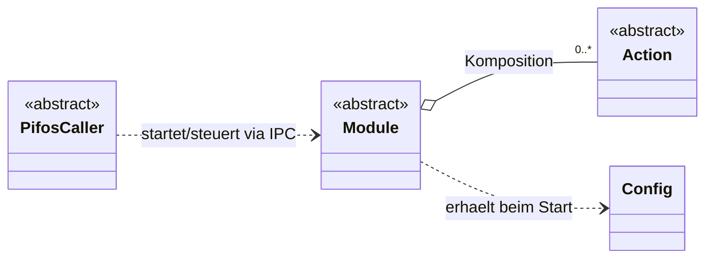
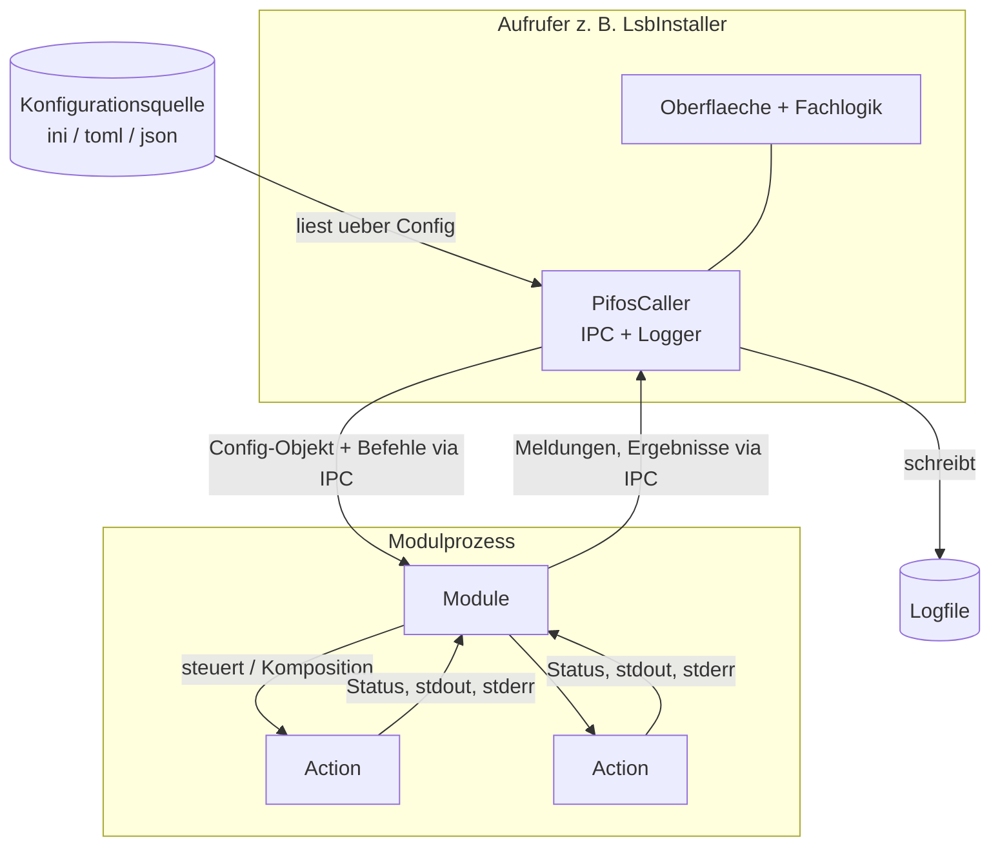
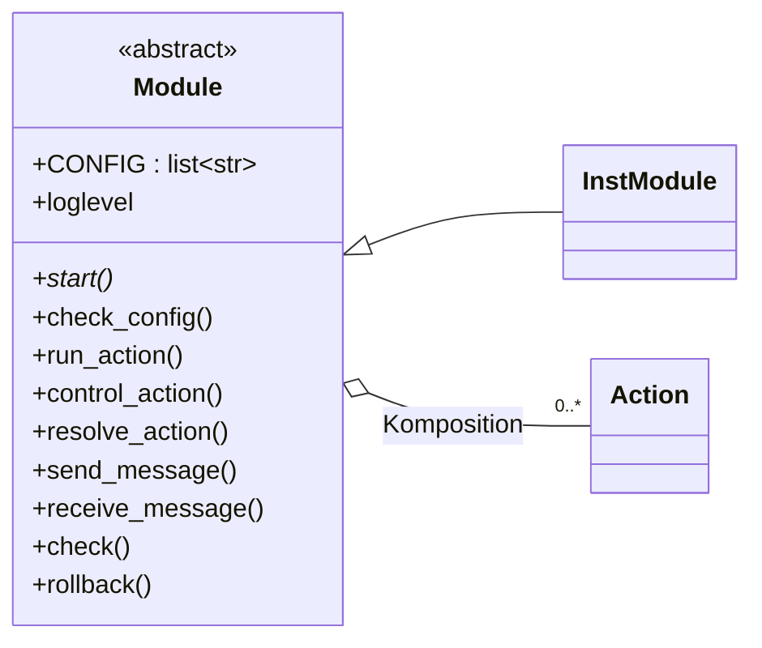
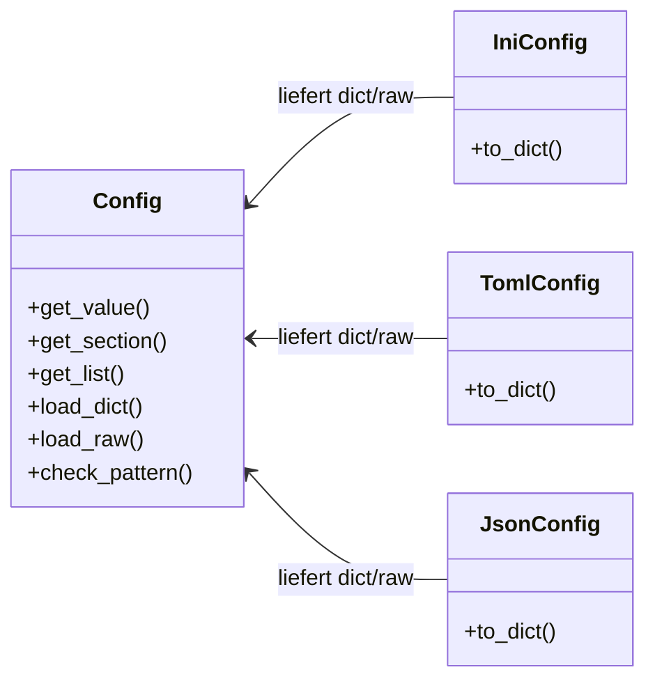
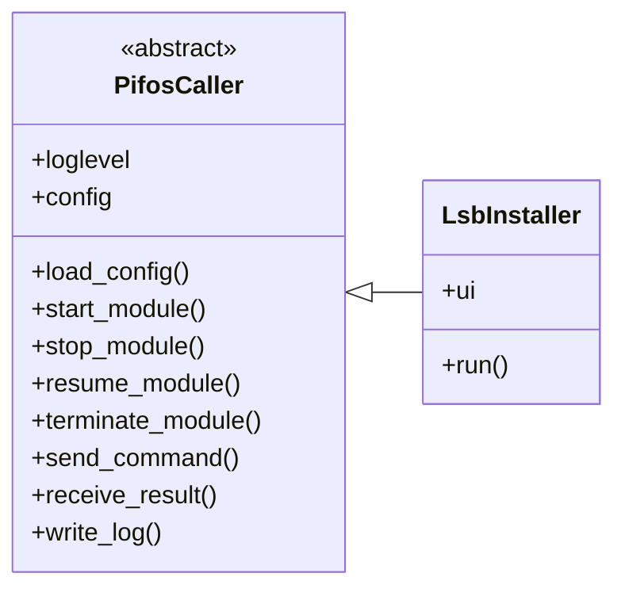
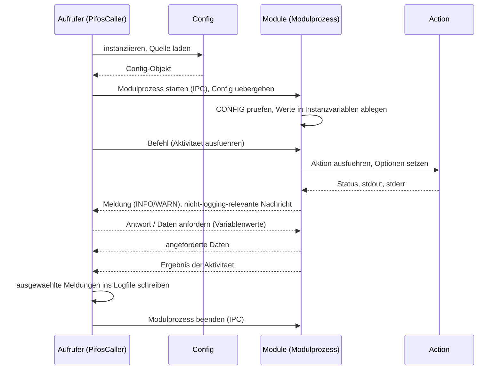
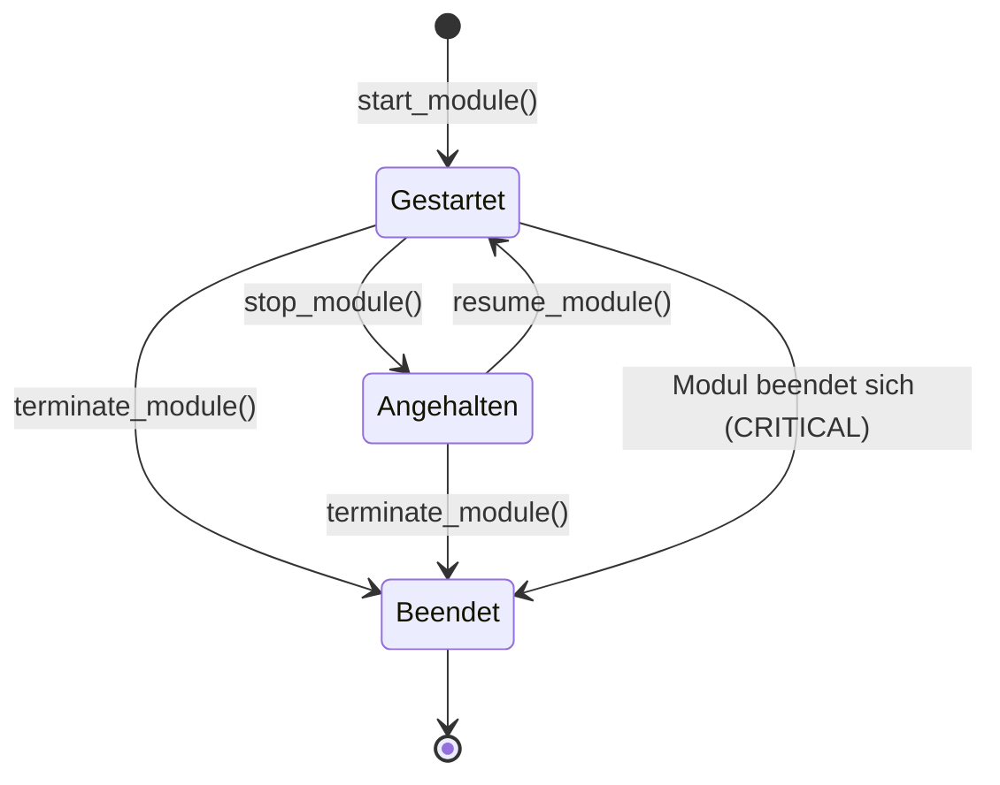

# pifos — Implementierungsplan

**Status:** [in Bearbeitung] · **Stand:** 2026-06-27

Dieser Plan beschreibt die Umsetzung von *pifos* auf Grundlage der Dokumente `docs/01_konzept.md`, `docs/02_anforderungen.md` und `docs/03_machbarkeit.md`.

Die Kennungen in Klammern (etwa ÜBR-01, SIC-03) verweisen auf die Anforderungen in `docs/02_anforderungen.md`.

Die Sicherheitsanforderungen aus Kapitel 13 „Sicherheit" der Anforderungen `docs/02_anforderungen.md` 

## Inhaltsverzeichnis

**1. Überblick und Architektur**  
**2. Aktionen**  
**3. Module**  
**4. Konfiguration**  
**5. Aufrufer-Basisklasse PifosCaller**  
**6. Prozessmodell, Steuerung und IPC**  
**7. Logging**  
**8. Fehlerbehandlung und Ausnahmen**  

## 1. Überblick und Architektur

*pifos* besteht aus den drei grundlegenden Komponenten *Aktionen*, *Module* und *Konfiguration*, sowie einer Aufrufer-Basisklasse zur leichteren Nutzung von *pifos* und einiger Helfer-Klassen (ÜBR-01). 

Jede der grundlegenden Komponenten wird durch eine Python-Klasse repräsentiert. *pifos* wird als Python-Paket `pifos/` mit kurzen Modulnamen zur Verfügung gestellt. *Aktionen* und *Konfigurationen* werden in den Unterpaketen `actions/` und `config/` abgelegt.

| Modul in `pifos/` | Inhalt |
|---|---|
| `action.py` | abstrakte Basisklasse `Action` |
| `actions/` (Unterpaket) | generische Aktionen, u. a. `SysCmdAction`, `CopyFileAction` |
| `module.py` | abstrakte Basisklasse `Module` |
| `config/` (Unterpaket) | `Config`, Formatklassen `IniConfig`, `JsonConfig`, `TomlConfig` |
| `caller.py` | abstrakte Basisklasse `PifosCaller` |
| `ipc.py` | `IpcMessage`, Enums `MessageKind`, `LogLevel` |
| `runner.py` | Einsprungfunktion des Modulprozesses |
| `errors.py` | Ausnahmehierarchie `PifosError` und Ableitungen |


### 1.1. Zusammenwirken

Aufrufende Skripte sollten eine Klasse beinhalten, welche von `PifosCaller` in `caller.py` erbt. Die Klasse `PifosCaller` stellt alle wesentlichen Funktionen zur Nutzung von *pifos* einschl. der IPC-Funktionalität zur Verfügung.  

Der Aufrufer instanziiert ein Config-Objekt mit einem spezifischen Konfigformat (z. B. 'ini', 'toml', 'json' usw.) und startet ein oder mehrere Module jeweils als eigenen Prozess (STR-01, STR-02). Dabei werden die erforderlichen Config-Daten als Config-Objekt an das Modul übergeben. Ein Modul wiederum hat eine oder mehrere Aktionen (Komposition) und steuert diese über Parameter und Instanzvariablen (MOD-01, MOD-06).  Das Modul leitet Meldungen, Ergebnisse und Ausnahmen über IPC an den Aufrufer. Die Führung des Logfiles ist Sache des Aufrufers (LOG-01, LOG-02).

Ein Beispiel für eine konkrete Action-Klasse und Formatklasse, sowie weitere Hilfsklassen und vollständige Methodenlisten für die abstrakten Klassen werden in den nachfolgenden Kapiteln (*2. Aktionen*, *3. Module* und *4. Konfiguration*) beschrieben.



Das folgende Datenflussdiagramm zeigt den bereits oben beschriebenen Datenfluss zur Laufzeit. Der Aufrufer liest die Konfiguration über `Config` aus der Quelle, startet die Modulprozesse und führt die Logdatei. Aktionen erfassen Status und Ausgaben der ausgeführten Befehle. Das Modul liest den Status aus den Instanzvariablen der Aktionen und erstellt daraus Meldungen, die per IPC an den Aufrufer weitergeleitet werden. Der Aufrufer verarbeitet die Meldungen, trifft anhand dieser Meldungen ggf. Entscheidungen und schreibt eine Logdatei (LOG-01, LOG-02).



### 1.2. Empfehlung zur Code-Gestaltung

Grundsätzlich sollte der einfachste Weg gewählt werden um eine Aufgabe zu lösen (KISS: 'keep it simple and stupid). Unnötige Vererbungen und komplexe Vererbungsstrukturen sollten vermieden werden. Komponenten (z. B. Config-Format-Klassen, oder Aktions-Klassen) sollten nur dann entwickelt werden, wenn sie auch wirklich benötigt werden (ÜBR-03, ÜBR-05).

Öffentliche Attribute sind i. d. R. direkt über `obj.x` zugänglich, *getter* und *setter* (`get_x()`/`set_x()`) werden nicht genutzt. Ein Zugriff über `@property` kann bei Bedarf genutzt werden (ÜBR-04).

Aktionen, die Dateien ändern, überschreiben oder löschen, müssen die Originaldatei vorher sichern oder vor Überschreiben ohne explizite Aufforderung schützen (AKT-06).


## 2. Aktionen

Eine *Aktion* erledigt genau eine Aufgabe und stellt deren Ausführung und Ausgaben vollständig dem aufrufenden Modul zur Verfügung (AKT-01, AKT-02). Alle Aktionen leiten von der Basisklasse `Action` ab, die gemeinsame Variablen und Methoden festlegt (AKT-05).


### 2.1 Basisklasse Action

`Action` ist eine abstrakte Basisklasse (`action.Action`) in `action.py`. Die konkreten Implementierungen der `Action`-Klasse erhalten die erforderlichen Parameter vom aufrufenden Modul. Das Klassenattribut `PARAMS: list[str]` enthält die Namen der erlaubten Parameter. Bei einer Aktion, die keine Parameter erfordert, bleibt `PARAMS` leer. Die `Action`-Klasse legt den Ausführungszustand in der Instanzvariablen `status` ab. Die `run`-Methode enthält die jeweilige konkret auszuführende Aktion. 

**HINWEIS**

`Action` überprüft die Parameter NICHT. D. h. die `Action`-Klassen gehen davon aus, dass die Werte VORHER geprüft und validiert wurden!


| Variable | Typ | Bedeutung |
|----------|-----|-----------|
| `status` | `str` | Zustand der Ausführung, *not_runned*, *running*, *finished* oder *failed*, Default: *not_runned* |
| `PARAMS` | `list[str]` | Klassenattribut: Namen der Parameter der Aktion; leer, wenn die Aktion keine Parameter hat |


| Methode | Rückgabewert | Bedeutung |
|---------|--------------|-----------|
| `run`(self) | `str` (`obj.status`) | Führt die konkrete Aktion aus, setzt den Status und liefert diesen zurück |


### 2.1.1. Implementierung von Action

Die Implementierungen von `Action` können weitere Konstruktorargumente oder Attribute zur Steuerung der Aufgabe enthalten.

Die Methode `run(self) -> str` beinhaltet bei konkreter Implementierung (Aktionen) die Ausführung der Aufgabe. Unmittelbar vor Beginn des ersten konkreten Ausführungsbefehls wird die Variable `status` auf *running' gesetzt. Nach Ausführung auf *finished* im Erfolgsfall und *failed* im Fehlerfall.

Die Ausführung der Aktion ist immer mit einer `try except`-Klausel zu versehen. Die Aktion darf niemals das gesamte Skript beenden! Im Fehlerfall wird die `status`-Variable auf *failed* gesetzt und eine Ausnahme der Klasse `ActionError` (siehe Kapitel 8 „Fehlerbehandlung und Ausnahmen") erzeugt. Die Ausnahme-Behandlung wird an das aufrufende Modul weitergereicht. Dabei ist darauf zu achten, dass möglichst umfangreiche Informationen zur Verfügung gestellt werden um ggf. eine weitere Diagnostik durch das aufrufende Modul zu ermöglichen.

Führt eine Aktion Systembefehle aus, werden `stdout` und `stderr` als Instanzvariablen eingeführt und in der `run()`-Methode mit der vollständigen Ausgabe der entsprechenden Kanäle (capturing) gefüllt. Zusätzlich wird die Instanzvariable `returncode` genutzt, um den Rückgabewert des Systembefehls abzulegen. Bei einem `returncode` ungleich '0' (Linux) wird eine `ActionError`-Ausnahme erzeugt und an das Modul übergeben.


## 3. Module

Ein *Modul* ist eine abstrakte Klasse vom Typ *Modul* (aus `module.py`) und dient zur fachlichen Abarbeitung von einer oder mehreren Aktionen. Sie erhält als Parameter ein `Config`-Objekt vom aufrufenden Prozess. Für die Durchführung seiner Aufgabe nutzen Module die *Aktionen* (MOD-01, MOD-02, MOD-05).

**HINWEIS**

Die vom Modul an die Aktionen weitergegebenen Parameter MÜSSEN vor Weitergabe GEPRÜFT werden, sofern dies nicht schon im aufrufenden Prozess erledigt wurde!

Die Basisklasse `Module` stellt auch die optionalen Methoden `check`, zur Überprüfung von Aktionen, und `rollback`, zum Rückbau der Aktion, bereit, welche bei Nutzung überschrieben werden müssen (MOD-12, MOD-13).

Das folgende Klassendiagramm zeigt die Basisklasse `Module` mit einem konkreten Beispiel-Modul sowie die Komposition mit `Action`.



### 3.1. Basisklasse Module

`Module` ist die abstrakte Basisklasse zur Erstellung von Modulen in `module.py`. Sie stellt Methoden zur Ausführung und Steuerung von Aktionen sowie zur Interaktion mit dem aufrufenden Prozess zur Verfügung (MOD-05).

Das aufrufende Modul versorgt die Aktion mit diesen Parametern und prüft die Werte bei Bedarf selbst. Die formale Prüfung (z. B. 'ist Zahl', 'ist Email-Adresse') kann über die `check_pattern`-Methode (Kapitel 4 „Konfiguration") des `Config`-Objektes durchgeführt werden. Die inhaltlich fachliche Prüfung muss durch eigenen Code in der `Module`-Implementierung erfolgen. Beide Prüfungen können aber auch bereits im Aufrufer erfolgen.

Über die Methoden `send_message` und `receive_message` kommuniziert das Modul über IPC mit dem aufrufenden Prozess (Kapitel 6 „Prozessmodell, Steuerung und IPC").

`resolve_action` sucht eine Aktion im Aktions-Verzeichnis und liefert als Rückgabewert die `Action`-Klasse bei Erfolg oder meldet einen Fehler bei Misserfolg.

| Methode | Zweck |
|---------|-------|
| `start(self) -> int` | abstrakt: führt die Modulaufgabe aus, gibt den Rückgabewert zurück |
| `check_config(self, config: Config) -> None` | prüft die Werte beim Start anhand `CONFIG` und legt sie ab (MOD-09) |
| `run_action(self, action: Action) -> int` | führt eine Aktion aus und übernimmt deren Status (MOD-01) |
| `control_action(self, action, **options) -> None` | steuert eine Aktion über Parameter oder Instanzvariablen (MOD-06) |
| `resolve_action(self, name: str) -> type[Action]` | schlägt eine Aktion im Aktions-Verzeichnis nach und liefert ihre Klasse; Fehler, wenn sie nicht existiert (MOD-05) |
| `send_message(self, level, name, payload) -> None` | reicht eine Meldung an den Aufrufer (LOG-02) |
| `receive_message(self) -> IpcMessage` | nimmt einen Befehl des Aufrufers an (STR-04) |
| `check(self) -> bool \| None` | optional: prüft den Erfolg der eigenen Eingriffe und gibt das Ergebnis zurück; Default `None` (keine Überprüfung), ein Modul mit prüfbarer Wirkung überschreibt sie (MOD-12) |
| `rollback(self) -> bool \| None` | optional: nimmt die Eingriffe zurück und meldet, ob der Rückbau gelang; Default `None` (kein Rollback), ein Modul mit umkehrbarer Wirkung überschreibt sie (MOD-13) |

#### 3.1.1. Implementierung von Module

Module sollen beschreibende Namen erhalten um den Verwendungszweck zu erkennnen, so sollte z. B. ein Installationsmodul den Klassennamen `InstModule`  und/oder den Dateinamen `inst_` erhalten (MOD-07).

##### 3.1.1.1. Konfigurationsdeklaration und Prüfung

Ein Modul listet in `CONFIG` die benötigten Konfigurationsparameter auf. Diese Liste ist letztlich rein informativ für den aufrufenden Prozess und impliziert keine Prüfung oder Vorgabewerte (MOD-10, MOD-11). Beim Start prüft `check_config` das Vorhandensein der in `CONFIG` genannten Werte und legt sie in den Instanzvariablen des Moduls ab (MOD-09, MOD-04).

Eine formale Prüfung einzelner Konfigurationswerte ist über die `Config`-Methode `check_pattern` möglich (Kapitel 4 „Konfiguration"). Die fachlich inhaltliche Prüfung (z. B. korrekte Pfade beim Kopieren einer Datei) der Konfiguration wird im das Modul aufrufenden Prozess empfohlen, kann aber auch im Modul erfolgen.

##### 3.1.1.2. Überprüfung und Rollback

Die Methoden `check` und `rollback` sind optional und dienen als standadisierte Aufrufe für die Überprüfung der erfolgreichen Abarbeitung des Modules oder der Zurücknahme der durchgefüherten Aktivitäten.

Die Methode `check(self) -> bool | None` gibt bei erfolgreicher Bestätigung der Modulaktivitäten 'True' zurück und im Fehlerfall 'False'. Per default liefert die nicht überschriebene Methode 'None' zurück und zeigt damit an, dass `check(self)` in diesem Modul nicht implementiert wurde. Die genauen Tests zur Überprüfung müssen in der Methode programmiert werden.
 
Die Methode `rollback(self) -> bool | None` nimmt die Eingriffe zurück (MOD-13). War der Rückbau erfolgreich, liefert `rollback(self)` den Wert `True` und im Fehlerfall den Wert `False` zurück. Per default liefert die nicht überschriebene Methode 'None' zurück und zeigt damit an, dass `rollback(self)` in diesem Modul nicht implementiert wurde. Die genaue Umsetzung des Rollbacks muss in der Methode programmiert werden.

Die Idempotenz-Erkennung eines bereits erfolgten Eingriffs ist modulabhängig und optional (MOD-14); eine allgemeine Pflicht besteht nicht.


## 4. Konfiguration

Die *Konfiguration* ist die Schnittstelle zwischen Anwender und *pifos*, d.h. die Module und Aktionen werden im Wesnetlichen durch Konfigurationen bzw. durch Einträge  Konfigurationsdateien gesteuert.

Für die unterschiedlichen Formate der Konfigurationsdateien (z. B. *.toml, *.ini, *.json) gibt es eigene Formatklassen die von der `Config`-Klasse genutzt werden um die Konfigurationswerte in einem Dictionary abzulegen. (KFG-01, KFG-04).

Darüber hinaus stellt die `Config`-Klasse eine Reihe von Zugriffsmethoden auf die Konfiguration zur Verfügung und bietet mit der Mehtode `check_pattern(self)` die Möglichkeite zu einer formalen Prüfung der Konfigurationswerte.

Zusätzlich bietet die `Config`-Klasse auch die Möglichkeit Konfigurationsdateien mit Hilfe der Formatklassen in unterschiedlichen Formaten zu speichern.

Das folgende Klassendiagramm zeigt die Klasse `Config` und die je Quellformat zuliefernden Formatklassen.



### 4.1 Config-Objekt

Die `Config`-Klasse im Unterpaket `config/` hält die Konfiguration intern als einfache Strukturen (dict, list) vor.

| Methode | Zweck |
|---------|-------|
| `load_dict(self, data: dict) -> None` | übernimmt die Konfiguration als dict (KFG-05) |
| `load_raw(self, raw: str) -> None` | übernimmt den unzerlegten Inhalt (KFG-06) |
| `load_file(self, path: str, format: str) -> None` | liest eine Datei über die zum Format passende Formatklasse und übernimmt sie (KFG-10) |
| `get_value(self, key: str)` | liefert einen Einzelwert (KFG-02) |
| `get_section(self, name: str) -> dict \| list` | liefert eine Sektion als dict oder list (KFG-02) |
| `get_list(self, key: str, sort: bool = False) -> list` | liefert eine sortierte oder unsortierte Liste (KFG-02) |
| `check_pattern(self, pattern: str, value) -> bool` | wendet ein formales Prüfmuster auf einen Wert an (KFG-09) |
| `write_config(self, format, path) | schreibt die aktuelle Konfiguration in eine Datei |

Eine inhaltliche Prüfung der Konfigurationsdaten findet nicht statt (KFG-08). 

Die Methode `check_pattern` stellt formale Prüfmuster bereit (z. B. 'vorhanden', 'nicht leer', 'ist Zahl', 'ist Liste', 'ist kommasepariert', 'syntaktisch gültige Mailadresse') (KFG-09). 

Die formale Prüfung läuft nicht automatisiert, sondern muss für jeden zu prüfenden Konfigurationwert aufgerufen werden. Die verfügbaren Prüfpattern erhalten Namen, die beim Aufruf der Methode angegeben werden (`pattern`).

### 4.2 Formatklassen

Für jedes genutzte Konfigurationsformat gibt es eine eigene Klasse, welche die Konfiguration standardisiert an `Config` übergibt (KFG-04). Jede Formatklasse bietet sowohl lesenden Zugriff (`to_dict()`) als auch schreibenden Zugriff (`write_config`()) (KFG-07). Die Methode `raw()` gibt die gesamte KOnfigurationsdatei als String zurück (KFG-06).

| Format | Klasse | Lesen | Schreiben |
|--------|--------|-------|-----------|
| ini | `IniConfig` | `configparser` | `configparser` |
| json | `JsonConfig` | `json` | `json` |
| toml | `TomlConfig` | `tomllib` | `tomli-w` (optional) |

Zum Zeitpunkt der ersten Implementierung werden Formatklassen für 'ini', 'toml' und 'json' migtgeliefert. Weitere Klassen können später noch hinzugefügt werden. Bei 'ini' wird das erweiterte 'ini'-Format (Verschachtelung) unterstützt. 

**HINWEIS**

Die Formatklassen werten die Konfifurationen und deren Werte NICHT aus (kein `eval`) und es dürfen nur sichere Varianten der Deserialisierung (also kein `pickle` oder `yaml.load`) nutzen. Die Prüfung der Konfiguration liegt ausschließlich in Unterklassen von `Module`und `PifosCaller` (SIC-17).

## 5. Aufrufer-Basisklasse PifosCaller

Mit der Basisklasse `PifosCaller` in `caller.py` stellt *pifos* eine einfache Möglichkeit zur Verfügung  die Nutzung der *pifos*-Infrastruktur zur Prozesssteuerung, IPC und Logging in eigenen Python-Scripten zu nutzen. Dazu muss das eigenen Script die Basisklasse `PifosCaller`einfach nur beerben (CAL-01, CAL-06). Dadurch kann sich das eigenen Scripte und Module i. d. R auf die reine Dachlogik konzentrieren.

Das folgende Klassendiagramm zeigt die Basisklasse `PifosCaller` und einen konkreten Aufrufer, der von ihr erbt.



### 5.1 Methoden der Basisklasse

Der `PifosCaller` lädt mit der Method `load_config()` eine Konfiguration. Die Konfiguration sollte u. a. auch das Loglevel festlegen (LOG-04, CAL-08, KFG-10, STR-02).

Beim Start eines Modules wird dem Modul die Config oder ein entsprechender Teil der Config und das Loglevel übergeben (STR-02, LOG-05). Module die keine Konfigurationsdaten benötigten bekommen auch keine Config übergeben (MOD-03). Mehrere Module können sequentiell oder auch parallel gestartet werden. Für die Kommunikation nutzt `PifosCaller` IPC-Pipes.

| Methode | Zweck |
|---------|-------|
| `load_config(self, path: str, format: str) -> None` | legt ein `Config`-Objekt an, lädt es über `Config.load_file` und stellt es als Instanzvariable `config` bereit (CAL-08) |
| `start_module(self, module_cls, config=None) -> Handle` | startet ein Modul als Prozess, übergibt Config und Loglevel (CAL-02, STR-01, STR-02, LOG-05) |
| `stop_module(self, handle) -> None` | hält einen Modulprozess an (CAL-02) |
| `resume_module(self, handle) -> None` | setzt einen angehaltenen Modulprozess fort (CAL-02) |
| `terminate_module(self, handle) -> None` | beendet einen Modulprozess gestuft (CAL-02) |
| `send_command(self, handle, name, payload=None) -> None` | sendet einen Befehl über IPC an das Modul (CAL-03, STR-04) |
| `receive_result(self, handle) -> IpcMessage` | empfängt oder fordert Meldungen und Ergebnisse an (CAL-04, STR-03) |
| `write_log(self, message) -> None` | schreibt eine Meldung ins Logfile (CAL-05, LOG-01) |


### 5.2 Reaktion auf den Modulausgang

Nach Prozessende eines Modules wertet `PifosCaller` den Rückgabewert aus (0 = Erfolg, sonst Fehler) (STR-05). Je nach Ausgang ruft die Basisklasse eine überschreibbare Methode auf (CAL-07).

| Methode | Auslöser |
|---------|----------|
| `on_module_success(self, handle)` | Rückgabewert 0 |
| `on_module_failure(self, handle, returncode)` | Rückgabewert ungleich 0 |
| `on_module_abort(self, handle)` | erzwungene Beendigung ohne regulären Abschluss |


## 6. Prozessmodell, Steuerung und IPC

### 6.1 Prozessmodell

Jedes Modul läuft in einem eigenen Betriebssystem-Prozess über `multiprocessing.Process`. Das deckt den Rückgabewert (STR-05), die sequenzielle und parallele Führung (STR-06) und die Steuerung (CAL-02) mit Bordmitteln ab. Ein eigener Prozess trägt einen eigenen Exitcode, ist über Signale anhaltbar und beendbar und ist gegenüber dem Aufrufer isoliert, was die CRITICAL-Selbstbeendigung eines Moduls absichert (EXC-03).

Die Startmethode ist `spawn`: Sie ist deterministisch und frei von den Sperr-Risiken, die `fork` bei einem mehrfädigen Aufrufer mit Rich-Oberfläche hätte. Voraussetzung ist, dass Modulklasse und `Config`-Objekt picklebar bleiben, also keine offenen Datei- oder Socket-Handles als Instanzvariablen halten (Bedingung B3 der Machbarkeit). `subprocess` mit eigenem Startskript ist nicht gewählt, weil es mehr Eigenbau verlangt und Module laut Konzept Python-Klassen sind; `threading` nicht, weil es keinen eigenen Exitcode, kein Anhalten über Signale und keine Isolation bei CRITICAL-Beendigung böte.

Das `Config`-Objekt übergibt der Aufrufer als Startargument von `multiprocessing.Process`; multiprocessing pickelt es in den Kindprozess (STR-02). Ein zusätzlicher Datei-Umweg entfällt, weil `Config` seine Daten als einfache Strukturen hält und damit picklebar ist (Bedingung B3). Module ohne Konfiguration erhalten kein Argument (MOD-03).

### 6.2 IPC-Mechanismus

Je Modulprozess besteht eine duplexe `multiprocessing.Pipe` zwischen Aufrufer und Modul (STR-01). Der Aufrufer schreibt Befehle hinab, das Modul schreibt Meldungen, Ergebnisse und Ausnahmen hinauf (STR-03, STR-04). Mehrere parallele Module multiplext der Aufrufer mit `multiprocessing.connection.wait()` über ihre Verbindungen (STR-06).

Die Pipe stellt synchron zu, ohne Hintergrund-Thread; eine Meldung erreicht den Aufrufer damit verlässlich vor dem Prozessende. Das erfüllt die CRITICAL-Zustellung (EXC-03) ohne Sonderbehandlung. `multiprocessing.Queue` ist nicht gewählt. Ihr interner Hintergrund-Thread müsste vor dem Prozessende geleert werden, sonst gehen Meldungen verloren, was die garantierte Zustellung bei CRITICAL-Beendigung gefährdet (EXC-03). Ein Unix-Domain-Socket oder TCP ist nicht gewählt, weil er für den rein lokalen Python-zu-Python-Fall mehr Eigenbau verlangt (ÜBR-03).

Die IPC erfolgt ausschließlich lokal zwischen Aufrufer und Modulprozess, nicht über Netz (SIC-07). Über IPC werden nur Daten innerhalb der Vertrauensdomäne des Aufrufers ausgetauscht, der seine eigenen Module startet; aus nicht vertrauenswürdiger Quelle wird nichts deserialisiert (SIC-08). Die übertragenen Nutzdaten beschränken sich auf einfache Datentypen; ausführbare oder zustandsbehaftete Objekte werden nicht übertragen (SIC-09).

### 6.3 Nachrichtenformat

Ein einheitliches Nachrichtenformat trägt alle Richtungen. Die dataclass `IpcMessage` in `ipc.py` wird von Aufrufer und Modul geteilt und über die Pipe übertragen.

| Feld | Typ | Bedeutung |
|------|-----|-----------|
| `kind` | `MessageKind` | Nachrichtenart |
| `level` | `LogLevel \| None` | Logstufe, soweit zutreffend (LOG-03) |
| `name` | `str` | Befehlsname oder Meldungskennung |
| `payload` | `object` | Nutzdaten als einfacher Datentyp (SIC-09) |

`MessageKind` ist ein Enum mit den Werten `COMMAND`, `LOG`, `MESSAGE`, `REQUEST`, `RESULT` und `EXCEPTION`. `COMMAND` und `REQUEST` laufen vom Aufrufer zum Modul (STR-04), `LOG`, `MESSAGE`, `RESULT` und `EXCEPTION` vom Modul zum Aufrufer (STR-03). `kind` trennt damit die logging-relevanten von den nicht logging-relevanten Nachrichten (STR-03). `LogLevel` ist ein Enum mit den vier Stufen `INFO`, `WARN`, `ERROR`, `CRITICAL` in aufsteigender Ordnung (LOG-03). Lose Tupel oder dicts ohne feste Struktur sind nicht gewählt, weil sie keinen verbindlichen Vertrag böten.

### 6.4 Hauptschleife des Modulprozesses

Ziel von `multiprocessing.Process` ist die Einsprungfunktion `module_runner` in `runner.py`:

```
module_runner(module_cls: type[Module], config: Config | None,
              conn: Connection, loglevel: LogLevel) -> int
```

Sie instanziiert das Modul, prüft mit `check_config` die Konfiguration anhand der Deklaration und legt die Werte in den Instanzvariablen ab (MOD-04, MOD-09). Danach tritt sie in die Befehlsschleife ein: Sie liest `IpcMessage` der Art `COMMAND` und `REQUEST`, bildet sie auf Modulmethoden ab (Aktivität ausführen, Daten anfordern, anhalten, fortsetzen, beenden), reicht Meldungen hinauf und endet bei `terminate` mit dem Rückgabewert des Moduls (STR-04, STR-05). Jeder Befehlsschritt liegt in `try/except` für die Ausnahme-Weiterleitung (Kapitel 8 „Fehlerbehandlung und Ausnahmen"). Eine einmalige Ausführung ohne Schleife ist nicht gewählt, weil sie die laufende bidirektionale Steuerung zwischen Aufrufer und Modul nicht böte (STR-04).

### 6.5 Anhalten und Fortsetzen

Anhalten und Fortsetzen erfolgen kooperativ über IPC an Prüfpunkten zwischen Aktionen (CAL-02). Der Aufrufer sendet einen Pause-Befehl; das Modul prüft an definierten Prüfpunkten zwischen seinen atomaren Aktionen und hält dort, bis ein Fortsetzen-Befehl kommt. So bleibt das Modul stets in konsistentem Zustand, und eine laufende Aktion wird nicht mitten in der Ausführung unterbrochen.

Die Signale SIGSTOP und SIGCONT sind nicht aufgenommen. Sie hielten den Prozess auch mitten in einer Aktion an und ließen einen bereits gestarteten Kindprozess eines Systembefehls weiterlaufen; ein solches erzwungenes Anhalten wäre eine Zusatzfunktion über das Geforderte hinaus (ÜBR-05). Eine spätere Ergänzung bliebe möglich, verlangte aber eine eigene Festlegung.

### 6.6 Beenden und Eskalation

Das Beenden eines Modulprozesses erfolgt gestuft in drei Schritten (CAL-02). Zuerst sendet der Aufrufer den IPC-Beenden-Befehl; das Modul schließt geordnet ab und stellt dabei zuerst seine ausstehenden Meldungen zu (EXC-03). Reagiert das Modul nicht innerhalb eines Zeitfensters, folgt SIGTERM über `Process.terminate()`, danach als letzte Stufe SIGKILL über `Process.kill()`. Der Regelfall ist der geordnete Abschluss über IPC; SIGTERM und SIGKILL sind die Rückfallebene für nicht reagierende Module.

Das folgende Sequenzdiagramm zeigt den zeitlichen Ablauf zwischen Aufrufer und Modul über IPC: der Aufrufer beschafft die Konfiguration, startet den Modulprozess, sendet Befehle hinab und erhält Meldungen und Ergebnisse hinauf. Das Modul steuert dabei seine Aktionen und entscheidet, welche Meldungen es weiterreicht (STR-01 bis STR-04, LOG-02).



Das folgende Zustandsdiagramm zeigt die Zustände eines Modulprozesses aus Sicht des Aufrufers. Die Übergänge ergeben sich aus den Steuermethoden der Aufrufer-Basisklasse (CAL-02).



Der Übergang „Modul beendet sich (CRITICAL)" zeigt den geordneten Selbstabschluss: Stuft ein Modul einen Fehler als CRITICAL ein und beendet sich, stellt es über die synchrone Pipe vorher sicher, dass die Ausnahme-Meldungen den Aufrufer noch erreichen (EXC-03).

## 7. Logging

Das Logging übernimmt allein der Aufrufer; Module und Aktionen führen kein eigenes Log, sondern reichen qualifizierte Meldungen per IPC nach oben (LOG-01, LOG-02). Dieses Kapitel legt die Logstufen, das Zusammenspiel von Modul und Aufrufer bei der Filterung und den Schutz protokollierter Fremddaten fest.

### 7.1 Stufen und Filterung

Das Logging unterscheidet die vier Stufen INFO, WARN, ERROR und CRITICAL, abgebildet als Enum `LogLevel` (LOG-03, Kapitel 6 „Prozessmodell, Steuerung und IPC"). Die vier Stufen bildet das `logging`-Modul der Standardbibliothek im Aufrufer ab. Das Loglevel des Aufrufers ist über die Variable `loglevel` einstellbar (LOG-04).

Der Aufrufer gibt das eingestellte Loglevel beim Start an das Modul weiter (LOG-05, Kapitel 5 „Aufrufer-Basisklasse PifosCaller"). Das Modul kennzeichnet jede `IpcMessage` mit ihrer Stufe (LOG-03) und kann Meldungen unterhalb der Schwelle bereits selbst zurückhalten; es entscheidet, was es sendet (LOG-02). Der Aufrufer entscheidet endgültig, welche der empfangenen Meldungen er ins Logfile aufnimmt (LOG-01, LOG-02). Die doppelte Filterung vermeidet, dass das Modul Meldungen sendet, die der Aufrufer ohnehin verwirft.

### 7.2 Schutz protokollierter Fremddaten

Der Aufrufer protokolliert auch Fremddaten, insbesondere stdout und stderr aufgerufener Befehle (AKT-02). Der Aufrufer legt das Logfile mit engen Rechten (`0600`) an, da es solche sensiblen Daten und interne Pfade enthält (SIC-27). Diese Daten werden vor dem Schreiben ins Logfile von Steuerzeichen, insbesondere Zeilenumbrüchen, befreit (SIC-19). In Logmeldungen, Ausnahme-Texten und IPC-Meldungen erscheinen keine Geheimnisse im Klartext (SIC-20). Fehlermeldungen nach außen sind allgemein gehalten; interne Pfade und Details gehen nur ins Log (SIC-23).

## 8. Fehlerbehandlung und Ausnahmen

Aktionen und Module erzeugen im Fehlerfall Ausnahmen; Module leiten sie an den Aufrufer weiter (EXC-01, EXC-02). Dieses Kapitel legt die Ausnahmehierarchie, ihre Übertragung über die Prozessgrenze und den sicheren Zustand bei Abbruch fest.

### 8.1 Ausnahmehierarchie

*pifos* führt eine schlanke Ausnahmehierarchie in `errors.py`. `PifosError` ist die gemeinsame Basisklasse; davon leiten `ActionError`, `ModuleError` und `ConfigError` ab. Aktionen erzeugen bei einem Fehler `ActionError`, Module `ModuleError`, die Konfigurationsprüfung `ConfigError` (EXC-01). Innerhalb eines Prozesses gibt eine Aktion ihre Ausnahme an das aufrufende Modul weiter (AKT-03); das ist die native Exception-Weitergabe der Sprache.

### 8.2 Weiterleitung über die Prozessgrenze

Eine Python-Exception überschreitet die Prozessgrenze zwischen Modul und Aufrufer nicht als natives Objekt. Die Befehlsschleife `module_runner` (Kapitel 6 „Prozessmodell, Steuerung und IPC") fängt Ausnahmen aus Aktionen und Modulmethoden und überführt sie in eine `IpcMessage(kind=EXCEPTION)`, die Typname, Meldung und den als Text formatierten Traceback trägt, sowie die Logstufe (EXC-02). Der Aufrufer empfängt sie und protokolliert oder verarbeitet sie. Das Pickeln des Exception-Objekts selbst ist nicht gewählt, weil nicht jede Exception verlustfrei picklebar ist und Tracebacks dabei teils verloren gehen.

Die Weiterleitung folgt dem Loglevel: Ausnahmen tragen die Stufen ERROR oder CRITICAL und werden stets weitergeleitet (EXC-02). Stuft ein Modul einen Fehler als CRITICAL ein und beendet sich, stellt es über die synchrone Pipe zuerst die Zustellung der Ausnahme-Meldung sicher und beendet sich dann mit einem Rückgabewert ungleich 0 (EXC-03, STR-05). Den Rückgabewert ungleich 0 legt das Modul selbst fest; eine feste Vorgabe besteht nicht.

### 8.3 Sicherer Zustand bei Abbruch

Bricht eine Aktion oder ein Modul ab, verbleibt kein undefinierter unsicherer Zustand; belegte Ressourcen werden freigegeben (SIC-21). Dateideskriptoren und Kindprozesse werden über Kontextmanager und gezieltes Aufräumen geschlossen, auch im Fehlerfall.

Die gestufte Beendigung kann bis SIGKILL eskalieren (Kapitel 6 „Prozessmodell, Steuerung und IPC") und einen Eingriff eines systemverändernden Moduls unvollständig hinterlassen. Nach einer erzwungenen Beendigung ist über den Überprüfungsmodus `check` (Kapitel 3 „Module") erkennbar, ob der Eingriff vollständig, teilweise oder nicht erfolgte (SIC-22). Der Überprüfungsmodus ist damit die Vorkehrung gegen den unvollständigen Zustand nach SIGKILL.

## Versionshistorie

| Version | Datum | Wer | Änderung |
|---------|-------|-----|----------|
| 0.01 | 2026-06-27 | Claude | Erstanlage als Rohmaterial: 18 WIE-Themen mit Optionen und Empfehlung. |
| 0.02 | 2026-06-27 | Claude | Ausarbeitung zum vollständigen Implementierungsplan: baustein-orientierte Gliederung (Überblick mit Klassendiagramm, Aktionen, Module, Konfiguration, PifosCaller, Prozess/IPC mit Sequenz- und Zustandsdiagramm, Logging, Ausnahmen); Empfehlungen in Festlegungen überführt, Sicherheitsanforderungen je Baustein eingearbeitet, Anforderungs-Rückverfolgung ergänzt; offene Entscheidung zu getter/setter (ÜBR-04) bei Martin belassen. |
| 0.03 | 2026-06-27 | Claude | Attributzugriff festgelegt (ÜBR-04): direkter Zugriff auf öffentliche Attribute, `@property` nur bei Zugriffslogik, interne Attribute ohne Zugriffsmethoden; abhängige Stellen in Überblick und Aktionen nachgezogen. Datenfluss-/Komponentendiagramm in Kapitel 1 ergänzt. |
| 0.04 | 2026-06-27 | Claude | Konsistenzbefunde behoben: tomllib-Version korrigiert (seit 3.11), Verweis auf gelöschtes Diagramm-Dokument entfernt, benannte Lesemethoden aus Klassendiagramm gestrichen, Inhaltsverzeichnis ohne Listen-Markup, resume_module im Zustandsdiagramm ergänzt; durchgängig Instanzvariable statt Klassenvariable; Stilkorrekturen (Vollsatz-Klammer aufgelöst, bildhafte Sprache ersetzt, „prüfen gegen" zu „auf … prüfen", Kapitelverweise mit Namen). |
| 0.05 | 2026-06-27 | Claude | Anforderungskennungen aus dem Fließtext gelöst (Aussage selbsterklärend, Kennung nur als Klammerzusatz am Satzende); Klassendiagramm auf die vier Kern-Basisklassen und ihre zentralen Beziehungen reduziert, Diagramm-Einleitung und nachgelagerte Formatklassen-Passage angepasst. |
| 0.06 | 2026-06-27 | Claude | Je ein fokussiertes Klassendiagramm in den Bausteinkapiteln Aktionen, Module, Konfiguration und Aufrufer ergänzt; zeigen die Detailstruktur des jeweiligen Bausteins passend zum Kapiteltext. |
| 0.07 | 2026-06-28 | Claude | Drei Kapitelverweise ohne Namen ergänzt (Kapitel 13 „Sicherheit" der Anforderungen, Kapitel 3 „Module", Kapitel 6 „Prozessmodell, Steuerung und IPC"). |
| 0.08 | 2026-06-28 | Claude | Kapitel 1 umgebaut: Datei-Tabelle auf umschließendes Paket `pifos/` mit Unterpaketen `actions/` und `config/` umgestellt, Module umbenannt (`pifos_caller.py`→`caller.py`, `config.py`→`config/`, `exceptions.py`→`errors.py`); Tabelle in die Kapiteleinleitung gezogen, Abschnitt 1.1 aufgelöst, Folgeabschnitte zu 1.1–1.3 aufgerückt; alle Abschnitts- und Dateibezüge nachgezogen, Tippfehler korrigiert. |
| 0.09 | 2026-06-28 | Claude | Stilabgleich: *pifos* und die Bausteinbegriffe an ihren Konzeptnennungen kursiv gesetzt; einmaligen Hinweis ergänzt, dass die Klammer-Kennungen auf die Anforderungen verweisen, und die Dateiangabe an der Einzelkennung gekürzt; Anglizismen ersetzt (Boilerplate, Launcher-Skript, Feeder-Thread) und kleinere Grammatik geglättet. |
| 0.10 | 2026-06-29 | Claude | Falsche Prozessrechte-Aussagen (SIC-10/11) entfernt: Rechte-Absatz in 1.2 gestrichen, Abschnitt 3.4 „Rechtekontext" entfernt (Folgeabschnitt zu 3.4 aufgerückt), Abschnitt 5.3 auf die SIC-12-Aussage zum Code-Baum reduziert und passend benannt. Logfile-Rechte `0600` (SIC-27) in 7.2 ergänzt. |
| 0.11 | 2026-06-29 | Claude | SIC-12 in die Bereitstellung übernommen, Abschnitt 5.3 „Code-Baum des Kerns" aufgelöst; „sowie den Rechtekontext" aus der Kapitel-3-Einleitung entfernt (Rückstand des entfernten Abschnitts 3.4). |
| 0.12 | 2026-06-29 | Claude | SysCmdAction (Abschnitt 2.2) in das neue Dokument `05_standardkomponenten.md` ausgelagert; Folgeabschnitte auf 2.2 (safe-mode) und 2.3 (Vertagtes Detail) aufgerückt, Abschnittsbezug in 2.1 angepasst. |
| 0.13 | 2026-06-29 | Claude | Zwischenklasse `SystemChangingModule` aufgelöst: `check` und `rollback` als optionale Methoden in die Basisklasse `Module` aufgenommen (`check(self) -> bool \| None`, Default `None`); Abschnitt 3.3 auf „Überprüfung und Rollback" umgestellt, Klassendiagramm, Kapiteleinleitung und Modul-Tabelle nachgezogen. |
| 0.14 | 2026-06-29 | Claude | Zentrale Aktions-Auflösung in `Module` ergänzt: `resolve_action` (Existenz/Klasse aus dem Aktions-Verzeichnis) und getrennt `check_action_params` (Parameter gegen die Aktions-Deklaration); Mechanik einmal in der Basisklasse statt je Modul. Füllung des Verzeichnisses als Detail vertagt. |
| 0.15 | 2026-06-29 | Claude | Parameter-Deklaration in `Action` ergänzt: Klassenattribut `PARAMS: list[ConfigItem]` (Name, Verbindlichkeit, Vorgabe, Prüfung, Beschreibung je Parameter, Struktur wie `Module.CONFIG`); Grundlage für `check_action_params`. |
| 0.16 | 2026-06-30 | Claude | Konfigurations-/Parameter-Deklaration vereinfacht (Entscheidung Martin): `CONFIG` und `PARAMS` sind reine Namenslisten (`list[str]`); `ConfigItem` samt Abschnitt 4.3 und Diagrammklasse entfernt, Abschnitt „Absicherung des Ladens" auf 4.3 aufgerückt. Pflicht/Kann, Vorgabewert und inhaltliche Prüfung liegen im Modul bzw. Aufrufer; `check_config`/`check_action_params` auf Vorhandensein bzw. Vollständigkeit reduziert. `check_pattern`-Ablauf ergänzt, Parameter `name`→`pattern`. |
| 0.17 | 2026-06-30 | Claude | `check_action_params` aus `Module` gestrichen (Entscheidung Martin); nach der Vereinfachung auf Namenslisten blieb nur ein Namensabgleich. In `Module` verbleibt `resolve_action`; die Parameter-Werte prüft das Modul oder der Aufrufer selbst. |
| 0.18 | 2026-06-30 | Claude | Konsistenzbefunde behoben: Dateiverweis `05`→`06_bereitstellung.md` (4.2); ins Leere zeigenden safe-mode-Kapitelzeiger in 3.3 entfernt; `run`-Rückgabe in der Tabelle (2.1) auf `int` vereinheitlicht; `stdout`/`stderr`/`returncode` in 2.1.1 als Instanzvariablen benannt; `obj.x` (1.2); `MOD-01` (1.1). |
| 0.19 | 2026-06-30 | Claude | `run`-Rückgabe zurück auf den Status (`str`, `obj.status`): Tabelle 2.1 und Signatur in 2.1.1 angeglichen (Korrektur zu 0.18, Entscheidung Martin). |
| 0.20 | 2026-06-30 | Claude | Rechtschreib- und Tippfehler in den Kapiteln 1–3 korrigiert; doppelte Abschnittsnummer 3.1.1.1→3.1.1.2; toten IPC-Halbsatz in 3.1 entfernt. Grammatikalisch unklare Sätze und Konsistenzpunkte (u. a. `rollback`-Signatur) zur Klärung unangetastet gelassen. |
| 0.21 | 2026-06-30 | Claude | `rollback`-Signatur auf `bool \| None` gezogen (passend zum Text und zu `check`); `rollback`-Zeile in der Methodentabelle von 3.1 ergänzt. |
| 0.22 | 2026-07-01 | Claude | `load_config` in die Methodentabelle von 5.1 aufgenommen (lädt Konfiguration aus einer Datei, liefert `Config`); Beschaffungssatz in 5.1 darauf umgestellt (CAL-08). |
| 0.23 | 2026-07-01 | Claude | Config-Laden von `PifosCaller` zu `Config` verschoben (Entscheidung Martin): `load_config` aus 5.1 entfernt, `load_file` in die Config-Tabelle 4.1 aufgenommen; Beschaffungssatz auf `Config.load_file` umgestellt (KFG-10 statt CAL-08). |
| 0.24 | 2026-07-01 | Claude | Aufrufer hält die Konfiguration als Instanzvariable `config`; Methode `load_config` (legt `Config` an, lädt via `Config.load_file`, stellt als `config` bereit) in 5.1-Tabelle und Diagramm ergänzt (CAL-08, Entscheidung Martin). |
