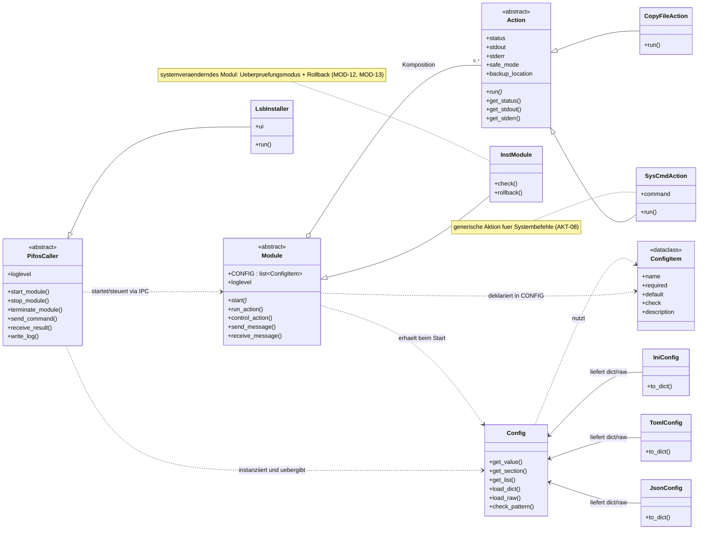
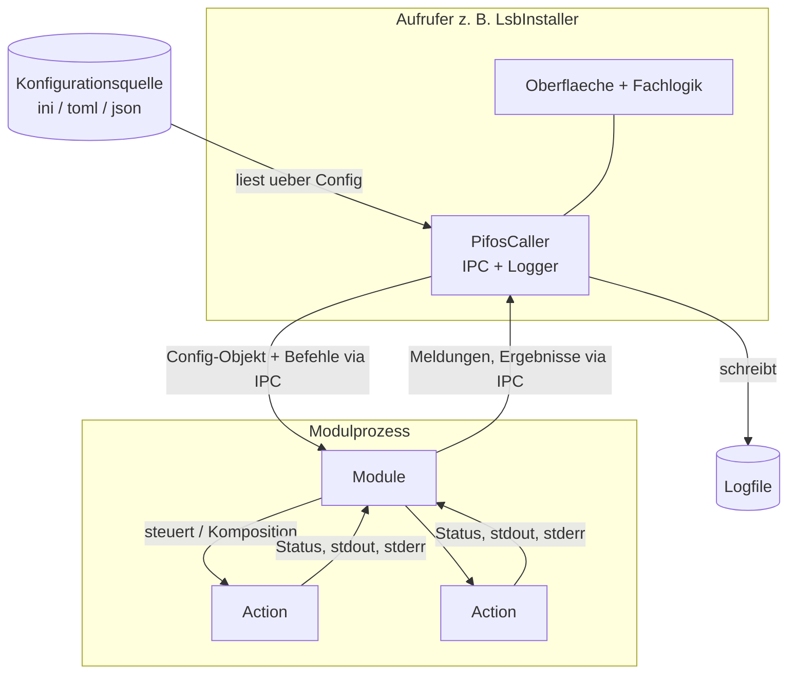
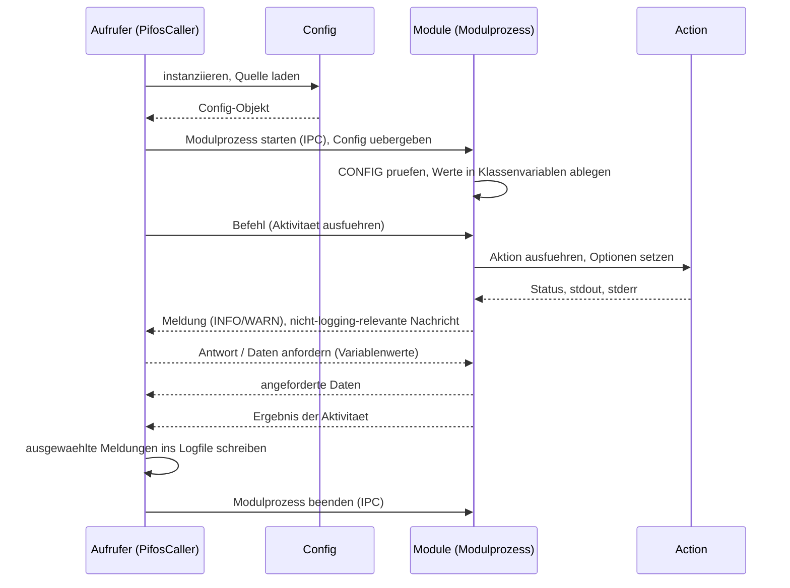
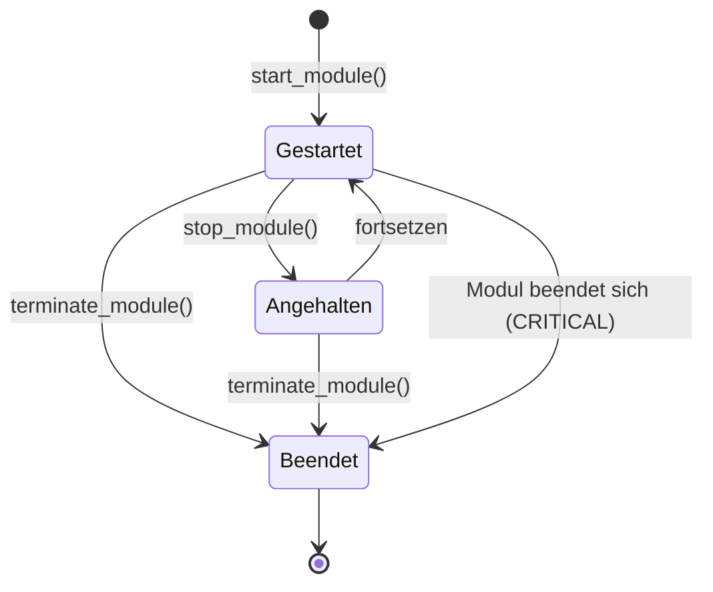

# pifos — Diagramme

**Status:** [in Bearbeitung] · **Stand:** 2026-06-26

Dieses Dokument visualisiert den Aufbau und die Abläufe des Bausatzes pifos (python infrastructure for operational services), um das Verständnis zu erleichtern. Maßgeblich ist `docs/01_konzept.md`, ergänzend `docs/02_anforderungen.md`. Die Diagramme bilden nur ab, was dort festgelegt ist. Auf dieser Ebene werden konkrete Klassen- und Dateinamen aus dem Konzept verwendet (`PifosCaller`, `pifos_caller.py`, `ConfigItem`, `config.py`).

Format ist Mermaid in Markdown; GitHub rendert es nativ.

## Inhaltsverzeichnis

1. Klassendiagramm
2. Komponenten- und Datenflussdiagramm
3. Sequenzdiagramm: Aufruf und Steuerung über IPC
4. Zustandsdiagramm: Modulprozess

## 1. Klassendiagramm

Das Klassendiagramm zeigt die drei Bausteine von pifos und ihre Beziehungen: die Basisklassen für Aktionen und Module, die Konfiguration mit Config-Objekt und formatspezifischen Klassen sowie die Aufrufer-Basisklasse mit einem konkreten Aufrufer.

Ein Modul nutzt Aktionen über Komposition (`Module` HAT `Action`). Konkrete Aktionen und Module erben von ihrer jeweiligen Basisklasse. Ein konkreter Aufrufer wie der Installer erbt von `PifosCaller`. Die abstrakten Methoden der Basisklassen sind kursiv dargestellt; alle Klassenvariablen besitzen laut Anforderung ÜBR-04 getter und setter, im Diagramm aus Übersicht nicht je Variable ausgeführt.

## 2. Komponenten- und Datenflussdiagramm

Das Komponentendiagramm zeigt, wie die Teile zur Laufzeit zusammenwirken und wohin Daten fließen. Der Aufrufer instanziiert die Konfiguration aus einer Konfigurationsquelle, startet darüber Modulprozesse und führt als einziger das Logfile.

Die Trennung der Verantwortung folgt dem Konzept: Aktionen erfassen Status und Ausgaben, das Modul reicht ausgewählte Meldungen per IPC nach oben, und nur der Aufrufer schreibt das Logfile (LOG-01, LOG-02).

## 3. Sequenzdiagramm: Aufruf und Steuerung über IPC

Das Sequenzdiagramm zeigt den zeitlichen Ablauf zwischen Aufrufer und Modul über IPC: der Aufrufer beschafft die Konfiguration, startet den Modulprozess, sendet Befehle hinab und erhält Meldungen und Ergebnisse hinauf. Das Modul steuert dabei seine Aktionen und entscheidet, welche Meldungen es weiterreicht.

Der Ablauf folgt den Anforderungen STR-01 bis STR-04 (Start über IPC, Übergabe der Konfiguration, bidirektionale Nachrichten) sowie LOG-02 (Modul wählt aus, was es meldet; Aufrufer wählt aus, was er protokolliert).

## 4. Zustandsdiagramm: Modulprozess

Das Zustandsdiagramm zeigt die Zustände eines Modulprozesses aus Sicht des Aufrufers. Das Konzept (Kapitel 3.3, Standardaufrufer) legt fest, dass die Aufrufer-Basisklasse Modulprozesse starten, anhalten und beenden kann; daraus ergeben sich die Übergänge.

Der Übergang „Modul beendet sich (CRITICAL)" bildet EXC-03 ab: Stuft ein Modul einen Fehler als CRITICAL ein und beendet sich, stellt es vorher sicher, dass die Ausnahme-Meldungen den Aufrufer noch erreichen.

## Versionshistorie

| Version | Datum | Wer | Änderung |
|---------|-------|-----|----------|
| 0.01 | 2026-06-26 | Claude | Erstanlage: Klassen-, Komponenten-/Datenfluss-, Sequenz- und Zustandsdiagramm in Mermaid, abgeleitet aus `docs/01_konzept.md` und `docs/02_anforderungen.md`. |
</content>
