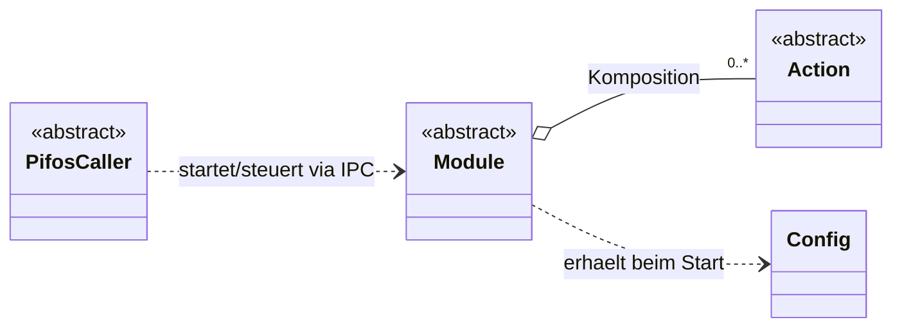
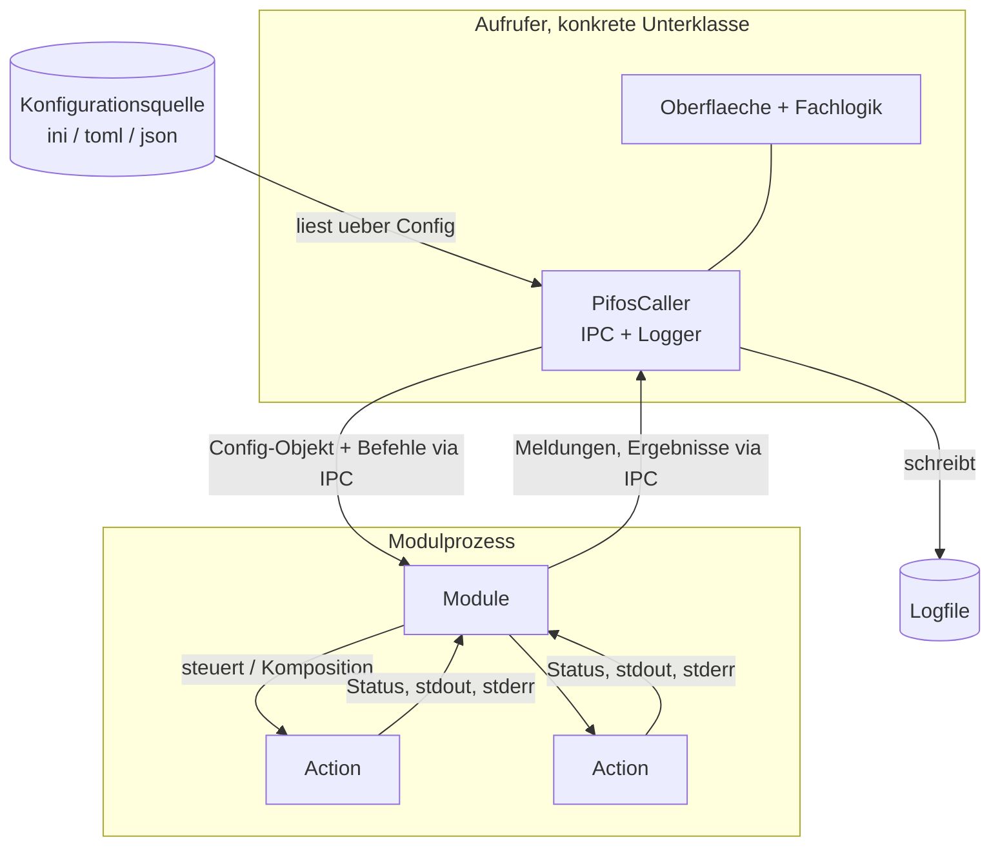

# 1. Überblick und Architektur

*pifos* besteht aus drei grundlegenden Komponenten — *Aktionen*, *Module* und *Konfiguration* — sowie einer Aufrufer-Basisklasse und einigen Helfer-Klassen. Jede grundlegende Komponente ist eine Python-Klasse. *pifos* wird als Python-Paket `pifos/` mit kurzen Modulnamen bereitgestellt; Aktionen und Konfiguration liegen in den Unterpaketen `actions/` und `config/`.

| Modul in `pifos/` | Inhalt |
|---|---|
| `action.py` | abstrakte Basisklasse `Action` |
| `actions/` (Unterpaket) | konkrete Aktionen: Systembefehl (`SysCmdAction`), Dateioperationen (`CopyFileAction`, `WriteFileAction`, `MoveFileAction`, `DeleteFileAction`, `LineInFileAction`, `BlockInFileAction`, `ReplaceInFileAction`), Verzeichnisse und Metadaten (`MakeDirAction`, `PermissionsAction`, `SymlinkAction`), Archive (`TarAction`, `UntarAction`), Paketverwaltung (`AptAction`), Dienststeuerung (`SystemdServiceAction`); gemeinsames Hilfsmodul `_file_ops.py` |
| `module.py` | abstrakte Basisklasse `Module` |
| `config/` (Unterpaket) | `Config`, Formatklassen `IniConfig`, `JsonConfig`, `TomlConfig` |
| `configurator.py` | Konfigurator `Configurator`, Persistenz und Kommando-`main` |
| `caller.py` | Basisklasse `PifosCaller`, Handle-Klasse `ModuleHandle` |
| `ipc.py` | Nachrichtenformat `IpcMessage`, Enums `MessageKind`, `LogLevel` |
| `runner.py` | Einsprungfunktion `module_runner` des Modulprozesses |
| `errors.py` | Ausnahmehierarchie `PifosError` und Ableitungen |

## 1.1. Zusammenwirken

Ein aufrufendes Skript definiert eine Klasse, die von `PifosCaller` erbt. `PifosCaller` stellt die wesentlichen Funktionen zur Nutzung von *pifos* bereit: Prozessstart, IPC und Logging.

Der Aufrufer lädt über `Config` eine Konfiguration aus einer Datei und startet ein oder mehrere Module jeweils als eigenen Prozess. Die benötigten Konfigurationsdaten übergibt er dem Modul als `Config`-Objekt. Ein Modul hält eine oder mehrere Aktionen (Komposition) und steuert sie über Parameter und Instanzvariablen. Meldungen, Ergebnisse und Ausnahmen reicht das Modul über IPC an den Aufrufer; das Logfile führt allein der Aufrufer.

Zur Laufzeit liest der Aufrufer die Konfiguration über `Config` aus der Quelle, startet die Modulprozesse und führt die Logdatei. Aktionen erfassen Status und Ausgaben der ausgeführten Befehle. Das Modul liest den Status aus den Instanzvariablen der Aktionen und bildet daraus Meldungen, die es per IPC an den Aufrufer weiterreicht. Der Aufrufer verarbeitet die Meldungen, trifft anhand ihrer gegebenenfalls Entscheidungen und schreibt das Logfile.

## 1.2. Gestaltungsgrundsätze

Der Code folgt dem einfachsten Weg zur Lösung einer Aufgabe (KISS). Unnötige oder tiefe Vererbungsstrukturen werden vermieden; Komponenten wie Format- oder Aktionsklassen entstehen erst, wenn sie benötigt werden.

Öffentliche Attribute sind direkt über `obj.x` zugänglich; `get_x()`/`set_x()` werden nicht verwendet. Wo Zugriffslogik nötig ist, kommt `@property` zum Einsatz.

Aktionen, die Dateien ändern, überschreiben oder löschen, schützen die bestehende Datei vor dem Überschreiben ohne ausdrückliche Freigabe oder sichern sie vorher (siehe [→ Aktionen](02-aktionen.md)).
